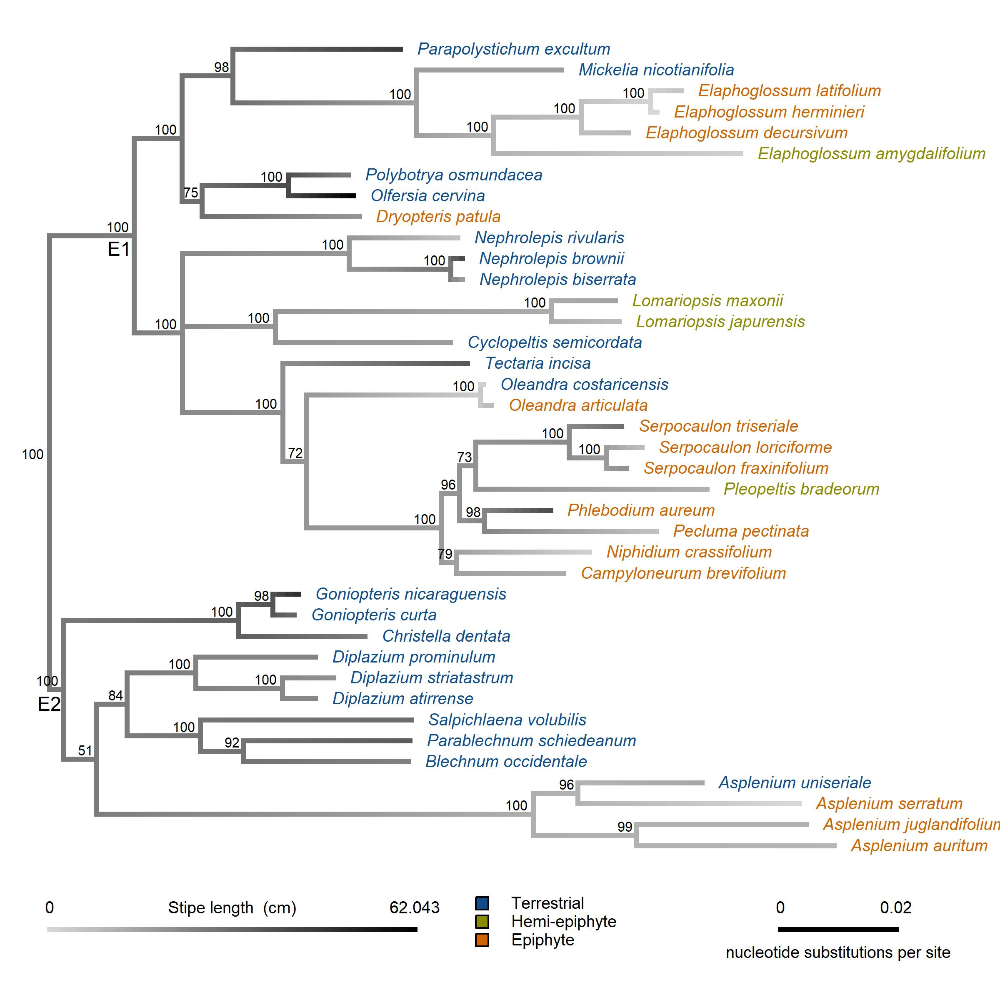
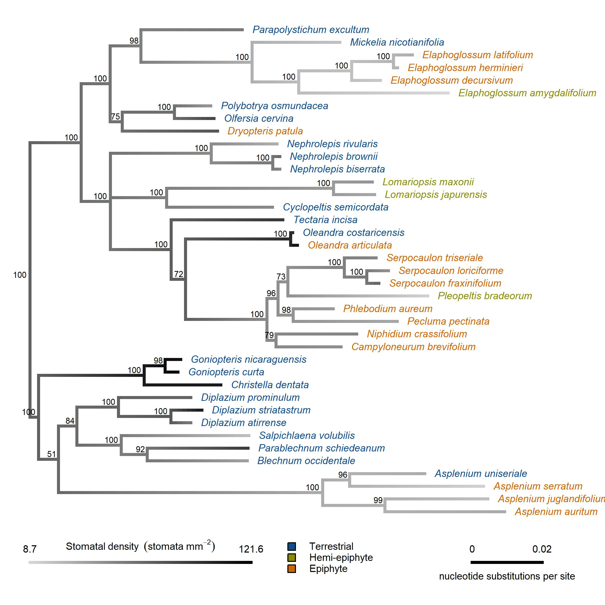
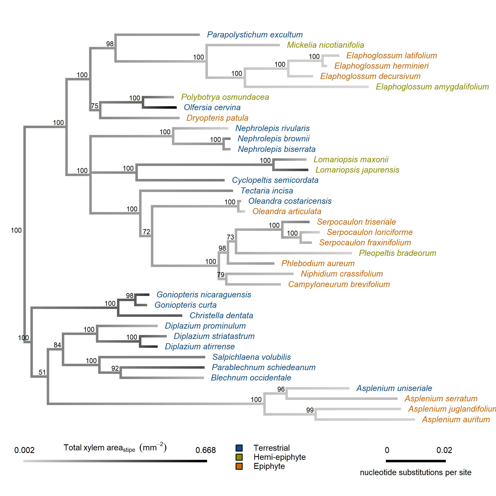

\
Courtney E. Campany^1^, Alex Baer^2^, Helen Holmlund^3^, Jarmila Pitterman^2^ James E. Watkins Jr. ^1^ and others

\
^1^ Department of Biology, Colgate University, Hamilton, NY, USA

\
^2^  Department of Ecology and Evolutionary Biology, University of California, Santa Cruz, California 95064, USA

\
Corresponding author: C.E. Campany, email: courtneycampany@gmail.com, 

\
Running Head: Terrestrial and epiphtic fern functional traits

```{r, results="asis", echo=FALSE, warning=FALSE}
library(knitr)
opts_knit$set(root.dir = '../')
```

```{r global data/sourcing, echo=FALSE, message=FALSE, warning=FALSE}
# Set Flag to include figures in text or not.
includeFigs <- TRUE
```

# Summary

* research and rationale
* methods
* key results
* main conclusion (key discussion points)

\

Key Words:

# Introduction

Following the rise of angiosperms, a major radiation event in ferns occurred in the Cretaceous period that led to the diversification and proliferation of modern fern taxa [@schuettpelz_evidence_2009]. Globally, fern species continue to adapt, thrive and serve important ecological roles in shaded understory environments. However, part of this large Cretaceous radiation event in tropical ferns included opportunistic diversification into more complex ecological niches provided by now dominant angiosperm canopies [@schneider_ferns_2004]. Consequently, one clade of ferns (Euploypoid I) has largely radiated into epiphytic niches, while a sister clade (Eupolypoid II) remained and diversified on the forest floor in tropical ecosystems [@watkins_ferns_2012]. Extant ferns and orchids are now the predominant tropical vascular epiphytes and ferns account for eight of the largest epiphyte genera [@gentry_diversity_1987; @cardelus_vascular_2006]. Importantly, epiphytes may be vulnerable to global change factors because they reside at an interesting interface of vegetation and the atmosphere, but evolutionary selection of tolerance mechanisms in epiphytic species may dampen this projection [@zotz_epiphytic_2009; @gotsch_life_2015].

\
Epiphytic tropical ferns grow across a continuum of canopy positions, from heavily shaded low trunk positions to exposed twigs of emergent trees [@watkins_ferns_2012]. A hemi-epiphyitc life form also exists in tropical ferns, with germination and establishment as an epiphyte that eventually establishes a terrestrial root-soil connection [@moffett_whats_2000; @zotz_hemiepiphyte_2013]. Consequently, the ecophysiology of all epiphytic ferns (and likely to some degree hemi-epiphytes) is moderated by variable and uncertain supplies of irradiance, mineral nutrition and water [@luttge_vascular_2012]. For example, vapor pressure deficit, light exposure and wind speed fluctuate with canopy position and size of tropical trees [@cardelus_vascular_2006; @watkins_hydraulic_2010; @woods_microhabitat_2015], nitrogen and phosphorus availability can be limited to foliar leaching and highly variable canopy soil [@cardelus_nutrient_2010] and water supply can be negatively impacted by the lack of soil connections, even with ample precipitation [@gotsch_life_2015]. The resulting micro-habitats for epiphytic ferns may often resemble niches we might never associate as being 'tropical' in nature and are undoubtedly fundamentally distinct from habitats terrestrial tropic ferns inhabit. Therefore, evolutionary selection of functional traits to adapt to these highly variable environmental conditions should have coincided with the opportunistic diversification of ferns into epiphyitc niches.
  
\
The ecological stresses of the epiphytic habitat have likely driven selection of functional traits for all residing vascular and non-vascular plant lineages. For example, epiphytic seed plants exhibit high adaptive capacity to maintain leaf water balance; including both drought tolerance and avoidance mechanisms, foliar water uptake and shifts in leaf capacitance [@gotsch_life_2015]. Alternatively, it is now generally accepted that seed-free vasuclar plant lineages (including ferns) exhibit evolutionary canalization of physiological function that may inherently inhibit their plasticity to changing environmental conditions. A suite of studies already reveal how anatomical traits directly influence physiology in ferns in a manner that is functionally different from seed plants (@woodhouse_stipe_1982; @zhang_epiphytes_2009; @brodribb_leaf_2005; @brodersen_physiological_2012). Even through a 1/3 of tropical fern species have diversified into tree canopies [@schuettpelz_evidence_2009], our understanding of how potentially limiting plasticity in ecophysiological function has still resulted in such a massive diversification is surprisingly unclear. 

\
Adaptations of morphological, anatomical and physiological traits that define plant water relations will be essential in the ecophysiological success of any epiphytic plant, yet our knowledge of how epiphytic fern species maintain plant water balance is currently underdeveloped. High degrees of desiccation tolerance has been detected in the gametophyte stages of epiphytic ferns [@watkins_ecological_2007], but far less is known of the sporophyte generation. Evolutionary canalized passive stomatal control has also been reported several times in ferns species [@brodribb_passive_2011; @ruszala_land_2011; @mcadam_fern_2012; @cardoso_hydraulics_2019], suggesting that ferns possess a diminished capacity to optimize water-use efficiency [@brodribb_evolution_2009]. This reported inefficient stomatal function likely contributes to reduced photosynthetic rates of tropical epiphytic ferns compared to figs and terrestrial ferns [@zhang_epiphytes_2009; @zhang_leaf_2014]. In these studies, thicker leaves, smaller and fewer stomata and reduced vein density inhibited photosynthetic performance in epiphytic ferns. Passive stomatal function should mean that gas exchange of epiphytic fern is primarily controlled by leaf water status. Consequently, anatomical and biomechanical traits that regulate leaf water supply may help elucidate how epiphytic ferns thrive in sub-optimal resource environments, despite canalized stomatal function. 

\
Compared to terrestrial habitats, ferns in epiphytic habitats should exhibit 
plasticity in anatomical and biomechanical traits to cope with drought stress [e.g. high light, high VPD & variable access to water, @saldana_ecophysiological_2005; @kessler_patterns_2007; @watkins_ecological_2007; @nishida_photosynthetic_2017]. Water transport in ferns occurs exclusively through hydraulically efficient primary vascular tissue, with xylem that exhibits a broad range of cavitation resistance [@pittermann_structure-function_2011]. Ferns have also been shown to have higher hydraulic safety margins in angiosperms, resulting from reduced hydraulic conductivity and rapid stomatal closure [@brodribb_stomatal_2004]. In epiphytic ferns, decreased conductivity in the xylems of stipes limits the amount of water supply available to a given leaf area, however this reduction in hydraulic capacity may increase drought tolerance [@watkins_hydraulic_2010]. Synthesizing these findings in ferns suggests that the evolution of xylem and stomata are likely connected from an ancestral state of water conservatism [@sperry_coordinating_2004], and the more recent diversification of epiphytic ferns allows exploration of the degree to which hydraulic tolerance or avoidance mechanisms manifest in key functional traits. 

\
This study tests the hypothesis that the evolution of plant functional traits typically related to drought tolerance promoted the radiation of ferns from largely moist, terrestrial habitats to far more unpredictable canopy habitats. We examined the resistance to hydraulic failure across field-sampled terrestrial, hemi-epiphytic and epiphytic ferns in Costa Rican tropical forests and related these data to a suite of anatomical and morphological traits that modulate leaf water status. We focused on a large representation of species from two recent fern lineages, Euploypods I and Euploypoid II, to explore epiphytic functional trait divergence in a phylogenetic context. We also sought to unpack the transitionary role the hemi-epiphytic life form serves, if any, to the radiation of ferns from terrestrial to epiphytic habitats. 

# Methods

## Study Site and Species Selection

The sites used for this study included two Costa Rican wet tropical forest locations at La Selva Biological Research Station in Heredia (84⁰00’12W, 10⁰25’52N) and Las Cruces Research Station in San Vito (8° 47′ 7” N, 82° 57′ 32” W). The La Selva site is a low elevation (ca 50 m) tropical forest, with a moderate dry season. The Las Cruces site is a premontane tropical forest located at a higher elevation (ca 1200 m). Both sites receive approximately 4m of annual rainfall [@holdridge_life_1967; @gentry_four_1993].

\
A survey of morphological, stoichiometric, anatomical and leaf water relations parameters were conducted for six individuals from 39 fern species across three fundamentally distinct life forms (Table S1). Across both sites, 18 terrestrial, 15 epiphytic and 6 hemi-epiphytic species were collected and measured.  In this study, terrestrial life forms were all collected from shaded closed canopy understories in the forest floor. Epiphytic life forms were sampled from trunks or within tree canopies, depending on the species. Epiphytic species were collected from canopy trees using single-rope climbing techniques, when necessary. Hemi-epiphytic species were all collected along lower sections of trees trunks (1-3 m). Importantly, all sampled hemi-epiphytic species are known to have root connections to forest floor soils at some point in their life history. Individuals of species were collected across multiple populations but within similar micro-habitat conditions. All sampled fern species were restricted to the Eupolypod I and II clades. Vouchers for each species were deposited at the respective site of collection at either the La Selva (LSCR) or Las Cruces (LCCR) herbariums. 

## Plant Material

Two complete fronds from sampled individuals were field collected in the early morning (6-7:30 am). One frond from each individual was utilized for pressure volume curves, while the other was sampled for structural morphology, lamina stoichmetry and anatomical traits. Stipes were cut at the base of the rhizome and cut ends were wrapped in wet paper towels and transported to the lab in black plastic bags. Stipes were re-cut under water and re-hydrated until time of hydraulic measurement (1-6 hours). Due to the difficulty in sampling some high canopy species; whole epiphytic individuals were carefully removed, maintained overnight in well-watered conditions in an ambient air laboratory and sampled the following day. 

## Leaf Morphometric traits

Stipe length (cm) and lamina length (cm) were calculated from one sampled frond per individual. Total frond length was calculated as the sum of stipe and lamina lengths. Total lamina area for each frond was measured with a Li-3100 leaf area meter (LiCor Biosciences, Lincoln, NE, USA). Leaf mass per unit area (LMA, g cm^-2^) was calculated using the tissue punch method. For each individual, ten lamina punches (5 mm^2^) were dried to a constant mass and LMA was calculated as the total dry mass divided by the total area of all leaf punches. 

## Anatomical traits

Stomatal density (SD) was measured by directly counting stomata on the abaxial leaf surface under 40x magnification. Three leaf punches (4 mm^2^ diameter) were sampled across random locations on different pinnae from each individual. The number of stomata in each field of view were counted in three random regions on each of three leaf punches. The stomatal density (# mm^2^) for each individual is presented as the mean SD across all 9 sampled regions. Individual images of stomata were directly photographed under 40x magnification (AmScope FMA050) across all three leaf punches per individual. Stomatal length (mm) and width (mm) of both guard cells were calculated for 9 stomata for each individual using Image J (National Institutes of Health, Bethesda, ML, USA). Stomatal size (SS, mm^2^) was calculated as guard cell length multiplied by the combined width of each guard cell pair, as in @franks_maximum_2009.

\
Stipes measured for vulnerability to cavitation were transversely sectioned by hand using razor blade. Stipes were sectioned at the distal end, where conduit resistivity impacts hydraulic conductivity the most. Sections were stained in toluidine blue and then mounted in glycerine on microscope slides. Each section was photographed using a light microscope mounted with a digital camera (Amscope FMA050). Section photographs were anatomically analyzed using ImageJ. Total xylem vascular area (mm^2^) was considered the conduit lumen area and the wall area for all xylem in each cross section. Huber values were calculated by dividing the total xylem vascular area by the lamina area it supported.

## Foliar chemistry

Sub-samples of foliage tissue, used for lamina area calculation, were collected across multiple locations on each pinnae for every individual. These sub-samples were dried to a constant mass and ground using a Wig-L-Bug (Sigma-Aldrich Co. St. Louis, USA). Nitrogen content and $\delta$C^13^ were measured using a Delta V isotope ratio mass spectrometer interfaced to a NC2500 elemental analyzer (Thermo Scientific) and corrected by comparison with certified standards. 

\
Lamina chlorophyll content was determined on three different pinnae for each individual. Single point measurements of chlorophyll content (mg m^-2^) were measured within a 3 mm diameter circle with the CCM-300 chlorophyll content meter (Opti-Sciences, Hudson, NH, USA). Chlorophyll content per individual is expressed as the mean of point measurements across the entire frond. **should we keep or drop this**

## Pressure-volume relations

Tissue-water relations were determined with pressure–volume analysis [@tyree_measurement_1972] on fully expanded fronds with a Scholander pressure bomb (PMS Instruments Co., Corvallis, OR, USA). For each pressure-volume (PV) curve, we sampled the top most intact pinnae after full re-hydration. We generated pressure–volume curves by taking sequential water potential measurements ($\Psi$~leaf~) as fronds air dried, first in closed plastic bags (0-3 hrs), and then in open air. The fresh mass was recorded immediately before and after each $\Psi$ determination. Following each PV curve, foliar samples were dried to a constant mass to calculate relative water content (RWC). For each PV curve, we graphed the relationship between 1/$\Psi$~leaf~ and leaf mass to estimate parameters related to leaf turgor and bulk tissue water relations. We then calculated leaf water potential at turgor loss ($\Psi$~tlp~), the osmotic potential at full tissue hydration ($\Pi$~o~), the bulk modulus of tissue elasticity ($\epsilon$) and tissue capacitance (C) according to @sack_prometheuswiki_2011. 
 
## Statistical analysis

Linear mixed-effect models were used to test responses of functional traits to categorical fixed effects of life form and collection site, as well as to test for bivariate relationships among key functional traits. The interaction between life form and collection site was tested to confirm any potential environmental or climate influence on functional trait patterns. Generally, there were few life form x collection site interactions, so models with life form and collection site as main effects were compared to full models (AIC scores) and the most parsimonious model was selected. To test for broad differences among life forms, individual plant species were treated as random effects in each model. Tukey’s post-hoc test were performed in conjunction with ANOVA to determine which mean values of functional traits were different among fixed effect treatments with the ‘multcomp’ package [@hothorn_simultaneous_2008]. We utilized a type 3 ANOVA due to an unbalanced design with the limited number of hemi-epiphytes species available. If interactions were present, we computed pairwise comparisons with the ‘emmeans’ package [@lenth_emmeans_2018] to investigate interactions between life form and site. For mixed-effect models, the conditional and marginal R^2^ values were calculated as per @nakagawa_general_2013. Tests of differences in slopes and elevations of bivariate relationships between morphological traits were implemented using standardized major axis regression in the 'smatr' package in R [@warton_smatr_2012]. 

\
A phylogenetic tree for these 39 fern species was constructed using the Maximum Likelihood method based on the Tamura 3-parameter model [@tamura_estimation_1992] and all evolutionary analyses were conducted in MEGA7 [@kumar_mega7_2016]. For each taxon, previously published sequences were obtained from GenBank (Table S1). In eight instances, it was necessary to use sequences from a closely-related species in the same genus as due suitable sequences from the focal species were unavailable. The tree was rooted with a single included representative of the Dennstaedtiaceae, *D. dissecta*. We first selected the best model of nucleotide substitution with jModelTest2 (default parameters) using both Akaike and Bayesian information criteria (AIC and BIC). The selected model was GTR+G+I (lset nst=6 rates=invgamma). 
We used Bayesian Inference in MrBayes to analyze sequence data [@huelsenbeck_mrbayes_2001; @ronquist_mrbayes_2003]. Two runs of four Markov Chain Monte Carlo (MCMC) chains (3 “heated” and 1 “cold”) were run in parallel in MrBayes for 1 × 106 generations and sampled every 5000 generations (mcmc ngen=1000000 samplefreq=500 printfreq=500 diagnfreq=5000). Tracer (shape of the trace + effective sample size (ESS) > 200) as well as the standard deviation of split frequencies (<0.01) were used to assess stationarity of the Markov chains.

\
The phylogenetic signal (K-statistic) based on Brownian motion-based metrics was calculated for each continuous trait using the ‘picante’ package in R[@kembel_picante_2010]. Values of 'K' for a given trait that are below 1 mean that relatives resemble one another less than we would expect for Brownian motion (lower phylogenetic signal), and vice verse for values of 'K' above 1 [@blomberg_testing_2003]. Significant *P* values for 'K' indicates that close relatives are more similar than random species pairs for the given trait. Additionally, bivariate relationships among mean species values of continuous traits were analysed with phylogenetically independent contrasts (PIC) in the 'ape' package in R [@paradis_ape_2019] to correct for possible non-independence resulting from phylogeny [@felsenstein_phylogenies_1985]. All PIC analyses were directly compared with the results of conventional ANOVA (described above) to better understand the functional and evolutionary relationships between traits. All tests of statistical significance were conducted at an $\alpha$ level of 0.05 and all analyses were performed with R 3.6.0 [@team_r_2013].

# Results

## Frond morphology and anatomy

Functional shifts in frond structural relationships for epiphtic species likely represent adaptation to the reduce the path length of water transport to lamina tissues. Total frond length was reduced by 26 % in epiphytic (59&pm;2.5) compared to terrestrial (85&pm;3.3) species, with frond length of hemi-epiphytes an intermediate between both groups (*P* = 0.021). The reduction in total frond length was driven by a large reduction (-54 %) in stipe length in epiphytic compared to terrestrial species (*P* = 0.001, Figure 1A). The majority of epiphytic and hemi-epiphytic ferns had stipes restricted to less than 20 cm (80% quantiles), while maximum stipe length of terrestrial ferns from the same probability distribution was 42.3 cm. Allometric relationships between  stipe length and lamina area were functionally different between epiphytic species compared to terrestrial and hemi-epiphytic species (Figure 1B, stipe length x life form; *P* = 0.002). Log relationships of stipe length and lamina area were positively correlated for each life form, however, pair wise differences were detected in both the slopes (*P* < 0.001) and elevation (*P* < 0.001) of this structural relationship for epiphytic species. Phylogenetic independent contrasts support the postive relationship between stipe length and lamina area for measured species (*P* < 0.001, R^2^ = 0.46).

\
Total xylem area was 60 % smaller in epiphytic and hemi-epiphytic species compared to terrestrial species (*P* = 0.003, Figure 2A). Consequently, terrestrial species produced more xylem area per unit leaf area than epiphytic or hemi-epiphytic species, resulting in higher Huber values (*P* = 0.001). (**add means here if no figure**). Increases in stipe length were positively correlated with increases in total xylem area across all life forms (*P* = 0.0002). Pair-wise differences were detected for the slopes (*P* < 0.0001) of this postive relationship between stipe length and xylem area across life forms, while elevations were similar (Figure 2B). Phylogenetic independent contrasts support the positive relationship between xylem area and stipe length for measured species (*P* < 0.001, R^2^ = 0.26).

\
No differences were detected in total lamina area between any of the life form groups, due to the large amount of variation in lamina area across species (R^2^ marginal = 0.17 and R^2^ conditional = 0.89). However, leaf mass per unit area (LMA) was 67% higher in epiphytic compared to terrestrial species, with hemi-epiphytic species intermediates between both life forms (*P* = 0.002, Figure 1C). Broadly, leaf thickness of terrestrial and hemi-epiphytic ferns was constrained to less than 300 g m^-2^, while epiphytic ferns species were capable of much higher values.

## Foliar chemistry 

Lamina nitrogen content (*N*) was 29.8% lower in epiphytic ferns compared to terrestrial and hemi-epiphytic ferns (*P* = 0.007). *N* was negatively correlated with increases in LMA for terrestrial and hemi-epiphytic species, but not for epiphytic species (LMA x life form *P* < 0.0001). Slopes and elevations of the significant relationship between *N* and LMA varied across life forms (Figure 3A). Phylogenetic independent contrasts, however, did not detect a relationship between *N* and LMA. Additionally, lamina $\delta$^13^C for terrestrial and hemi-epiphytic species was more negative that epiphytic species (*P* = 0.004, Figure 2C). Lamina $\delta$^13^C for fern species at the higher elevation Las Cruces site was also less negative (-32.6 &permil;) than fern species at the low elevation La Selva site (34.0 &permil;, *P* = 0.015).

\
Total chlorophyll content was similar between terrestrial and epiphytic species, although epiphytic species had a lower range of chlorophyll content. Hemi-epiphytic species had similar chlorophyll content to terrestrial species, but were 37 % higher than epiphytic species (*P* = 0.031).

## Stomatal anatomy

Epiphytic and hemi-epiphytic species had 51% lower stomatal density (36&pm;1.7 mm^-2^) compared to terrestrial species (72&pm;3.1 mm^-2^, *P* < 0.001). Stomatal length was similar across all species, however, guard cell width differed across life forms. Mean width of individual guard cells was 18 % smaller in terrestrial species compared to hemi-epiphytic of epiphytic species. Overall, stomatal size of terrestrial and epiphytic species were statistical similar, yet epiphytes had broadly higher stomatal size. Stomatal size in hemi-epiphtic species was 27 % larger than terrestrial or epiphytic life forms (*P* = 0.044). Increases in stomatal density were negatively correlated increases in stomatal density across all life forms (*P* < 0.001). Pair-wise differences across life forms were detected for the slopes (*P* < 0.001) and elevations (*P* = 0.007) of the negative relationship between stomatal density and stomatal size (Figure 4B). Phylogenetic independent contrasts support the negative relationship between stomatal density and stomatal size for measured species (*P* = 0.006, R^2^ = 0.17).

## Frond hydraulic traits

Surprisingly, minimal functional differences in drought tolerance where detected among the three life ferns from pressure volume curve parameters (Figure 2a). The turgor loss point ($\Pi$~tlp~) varied by fern life form (*P* = 0.042), however, post-hoc multiple comparisons did not detect differences in $\Psi$~tlp~ across terrestrial, hemi-epiphytic or epiphytic ferns. Broadly, terrestrial and hemi-epiphytic fern species had slightly lower $\Psi$~tlp~ than epiphytic species (Figure 2b). Additionally, the osmotic potential ($\Pi$~o~) decreased in terrestrial and hemi-epiphytic species (*P* = 0.009, Figure 2C), while the modulus of elasticity ($\epsilon$) was similar across all life forms. Consequently, the broad decreases in $\Psi$~tlp~ among terrestrial and hemi-epiphytic fern species appeared to be driven by osmotic adjustments via solute accumulations rather than shifts in cell wall flexibility [see @bartlett_determinants_2012]. Additionally, tissue capacitance at full turgor declined quickly with increasing $\epsilon$ and the tissue capacitance at the turgor loss point as 54 % lower in epiphytic compared to terrestrial species (*P* = 0.010, Figure 5D).

## Functional trait evolution

The degree to which a phylogenetic signal (K-statistic) was expressed in the functional traits for these tropical ferns species was generally low (Table 1). A significant phylogenetic signal was detected for stomatal traits and a few hydraulic traits, but was not apparent in morphological, anatomical or leaf chemical traits. Broadly, this suggests that the measured trait phenotypes of measured species resembled each other less than expected under Brownian motion evolution.

\
Ancestral state reconstructions also elucidated how tropical fern character states derived from terrestrial origins were adapted under selection pressures from new and distinct epiphytic environments within the Eupolypod clades. The selection for shorter stipes can be seen in divergence of both epiphytic and hemi-epiphytic species on the phylogeny (Figure 6). The selection for fewer stomata is also readily apparent in epiphytic species divergence, especially in the Eupolypods II clade (Figure 7). Additionally, the emergence of thick leaves (high LMA) and the reduction of total xylem area is almost entirely constrained to divergence events of epiphytic species of the Eupolypod species examined in this study (Figure S1 & S2). 

# Discussion

## Do biomechanical relationships define water transport capacity?

Tropical epiphytic ferns routinely face environmental conditions that are distinct from the forest floor. Despite large annual precipitation, epiphytic ferns without a root-soil connection still likely face strong selection pressures from a transient water supply. In conjuction with limited access to elemental nutrients (i.e. N and P), epiphytic ferns must adapt structural traits to optimize both nutient retention and efficient hydraulic transport. The evolution of these traits would have been essential to maintain a postive carbon balance as epiphytes radiated into the canopy niche. Here, evidence for the selection of both reduced xylem area and stipe length for water transport in the diversification of epiphtic and hemi-epiphytic ferns is evident in the phylogeny of our studied species. Additionally, evolutionary selection of thick laminas (&uparrow; LMA) is readily apparent in the diversification of epiphytic ferns. Evaluating why these strucutral traits evolved requires unpacking their role in the biomechanics of form and fucntion for epiphytic ferns.

/

Differences in structural scaling relationships between epiphyitc and terrestrial ferns have previously been detected with LMA and petiole width, suggesting a needed balance between hydraulic and biomechanincal support [@peppe_biomechanical_2014]. Our results build on these findings by elucidating several additional allometrical differences beteen epiphyitc and terrestrial tropical ferns. Structural relationships between stipe length and both lamina area and xylem area differed bewteen terrestrial and epiphytic life forms. Both these findings highlight adaptations to reduce the path length of water transport in epiphytic ferns; compared to longer pathlengths supported by greater surface area of conductive xylem in terrestrial ferns. As a consequence, reduced total frond length of epiphytic ferns does not appear to come at a consequence of conductive surface area of the lamina. Ecologically, these shifts in frond structure and anatomy in fern epiphytes should represent an adaptation to maintain positive water balance for lamina structural integrity and gas exchange in the absense of a root-soil connection.

/

turgor,
large datasets
tropical plants tlp
why?
tissue capacitance at the turgor loss point as 54 % lower in epiphytic compared to terrestrial species


The minimal stipe length of epiphytic ferns likely also represents an increased reliance on rhizomes for mechanical support (?)


/
Increases in foliar N  with increases with LMA have been reported in both terrestrial temperate ferns [@karst_are_2007] and tropical ferns [campany2018]. Here, this relationship was confirmed in terrestrial and hemi-epiphyitc tropical ferns but was uncoupled in fern epiphytes. 
, why not epiphytes (n limitation vs other capacitance functions?).

* Broadly, you cannot have a large stipe without large xylem area

## Do canalized traits define drought avoidance?
* canalized stomatal traits in seed-free plants still exhibit wide range of variability

water conservation strategies

foliar uptake capactiy in ferns?

## The role of hemi-epiphytic life-forms in the evolution of epiphytism in ferns

Understanding the evolutionary role of hemi-epiphytic ferns in the radiation of tropical ferns into epipytic niches is complicated by a limited species diversity available to measure. **For example, our phylogenetic ancestral trait  reconstructions suggest both terrestrial and epiphytic origins for extant hemi-epiphytic ferns species in this study.** Overall, hemi-epiphytic species shared characteristics of both terrestrial and epiphytic life forms, however, similarity in trait function does provide evidence of the transitionary role of the hemi-epiphytic life form. The morphological construction of fronds in hemi-epiphytic species resembles those of terrestrial origins. Similarity in structural allometry (stipe - lamina) and leaf thickness in hemi-epiphytic and terrrestrial ferns suggests that hemi-epiphytic species still optimize functional traits in relation to a low-light environment with a established root-soil connection. This terrestrial-centric trait optimization is also apparent in the similar mineral nutrition (foliar N content) and lamina water-use efficiency ($\delta$^13^C) of hemi-epiphytic and terrestrial fern species. Overall, these similarities should not be surprising if the root-soil connection in hemi-epiphytic species is established early in their sporophytic life history. However, if these morphological and stoichmetric traits are optmized differently in the early life stages of hemi-epiphytic fern species without a root-soil connection is unknown. As such, the plasticity in trait function as hemi-epiphytic fern sporophytes first establish and then develop soil connections should be investigated further.

\
On the other hand, hemi-epiphytic ferns retain traits associated with avoiding dessication that more closely resemble strategies of the measured epiphytic ferns. Reductions of both stipe length and total xylem area in hemi-epiphytic ferns suggest that adaptations to reduced water availability in their early establishment as epiphyites are likely conserved throughtout their life history. Similarily, decreases in stomatal density for hemi-epiphytes also reveals a lasting epiphytic adaptation to drought avoidance and water conservatism. The evolutionary origins of hemi-epiphytic species remains unclear, but our data do suggest that 'epiphytic-like' traits optimized to avoid dessication are likely maintained even when hemi-epiphytic ferns establish a permanent connection with a terrestrial water supply. This suggests an evolutionary epiphytic origin of extant hemi-epiphytic ferns, which could be further elucidated when plasticity of functional traits in the early establishing sporophyte (as an epiphyte) are better understood.

## Conclusions


# Tables

Table 1. Phylogenetic signal for X functional traits of tropical ferns sampled across the Euploypoid I & II clades. Measured species (n=39) encompass terrestrial, hemi-epiphytic and epiphytic habitats across two Costa Rican forest sites. **Eventually we will drop some of these**

```{r table1, echo=FALSE, warning=FALSE, message=FALSE}
library(pixiedust)
table1 <- read.csv("calculated_data/K_statistic_traits.csv")
table1_new <- table1[-c(3:4),c(6,1,4)]


dust(table1_new)%>%
  sprinkle_colnames("Functional Trait", "K-statistic", "*P*") %>%
  sprinkle(rows= 1, part="head",bold=TRUE)%>%
  sprinkle_print_method("markdown")
```

# Figures

```{r figure1,  echo=FALSE, fig.align='center',fig.width = 10, fig.height = 6, warning=FALSE, message=FALSE}
source("master_scripts/figure_1.R")

```
Figure 1. Structural shifts in path lengths to transport water, via stipe length, alters how tropical fern life forms build conductive structures. (A) Box plots of stipe length across tropical fern life forms. (B) Lamina area in tropical ferns is allometrically (log-based) related to  stipe length and this relationship varies by life form. The conditional and marginal R^2^ for the overall allometric relationship between lamina area and stipe length are 0.23 and 0.88, respectively. Significant log-linear fits for each life from are shown with dashed lines. The width of box plots are drawn proportional to the number of observations in each life form.

\

```{r figure2,  echo=FALSE, fig.align='center',fig.width = 10, fig.height = 6, warning=FALSE}
source("master_scripts/figure2.R")
```
Figure 2. Conductive hydraulic supply, via total xylem area, constrains stipe length in tropical fern species. (A) Box plots of Total xylem area across tropical fern life forms. (B) The capacity for greater total xylem area in terrestrial tropical ferns supports construction of large stipes. The conditional and marginal R^2^ for the overall positive relationship between stipe length and total xylem area are 0.30 and 0.88, respectively. Significant linear relationships for each life from are shown with dashed lines representing model fits and grey shaded areas as 95 % confidence intervals for the mean. The width of box plots are drawn proportional to the number of observations in each life form.

\

```{r figure3,  echo=FALSE, fig.align='center',fig.width = 12, fig.height = 6, warning=FALSE, message=FALSE}
source("master_scripts/figure3.R")

```
Figure 3. Shifts in lamina thickness (LMA) and lamina chemistry differ between tropical fern life forms. (A) Box plots of leaf mass per unit area (LMA) across tropical fern life forms. (B) LMA is negatively related to lamina nitrogen content in only terrestrial and hemi-epiphytic ferns. (C) Box plots of lamina $\delta$^13^C across tropical fern life forms (higher values indicate higher water-use efficiency). Significant linear relationships are shown with dashed lines representing model fits and grey shaded areas as 95 % confidence intervals for the mean. The width of box plots are drawn proportional to the number of observations in each life form.

\

```{r figure4,  echo=FALSE, fig.align='center',fig.width = 12, fig.height = 6, warning=FALSE, message=FALSE}

source("master_scripts/figure4.R")

```
Figure 4. Stomatal traits differed between tropical fern life forms. (A) Box plots of stomatal density across tropical fern life forms. (B) Stomatal density was negatively related to stomatal size for all life forms. Significant linear relationships for each life from are shown with dashed lines representing model fits and grey shaded areas as 95 % confidence intervals for the mean. The width of box plots are drawn proportional to the number of observations in each life form.

\

```{r figure5,  echo=FALSE, fig.align='center',fig.width = 12, fig.height = 12, warning=FALSE, message=FALSE}
source("master_scripts/figure5.R")

```
Figure 5. Epiphytic tropical ferns are not more drought tolerant than terrestrial or hemi-epiphytic tropical ferns. (A) Raw results from 211 pressure volume curves from 38 tropical fern species.  Box plots of turgor loss point (B) and osmotic potential (C) across tropical fern life forms. Relationship between tissue capacitance at full turgor and the bulk modulus of elasticity for tropical ferns (D) and box plots of the tissue capacitance at turgor loss point (inset). Fits for panels A,D for fern life forms use loess regression for visualization purposes. The width of box plots are drawn proportional to the number of observations in each life form.

\


\
Figure 6. Ancestral state reconstruction for stipe length mapped onto the phylogeny of the selected ferns examined in this study. A posterior probability are indicated at each node.

\


\
Figure 7. Ancestral state reconstruction for stomatal density mapped onto the phylogeny of the selected ferns examined in this study. A posterior probability are indicated at each node.

# Supplementary Information

Table S1. List of fern species examined in this study, included the clade to which they belong, the field site where they were sampled, their life form and Genbank information used to build the phylogeny.

```{r tableS1, echo=FALSE, warning=FALSE, message=FALSE}
library(pixiedust)
tableS1 <- read.csv("master_scripts/species_list_supp.csv")

dust(tableS1)%>%
  sprinkle(rows= 1, part="head",bold=TRUE)%>%
  sprinkle_font(cols=1:2, part="body",italic=TRUE)%>%
  sprinkle_print_method("markdown")
```

\


\
Figure S1. Ancestral state reconstruction for leaf mass per unit area (LMA) mapped onto the phylogeny of the selected tropical ferns examined in this study. A posterior probability are indicated at each node.

\


\
Figure S1. Ancestral state reconstruction for total xylem area mapped onto the phylogeny of the selected tropical ferns examined in this study. A posterior probability are indicated at each node. *Pecluma pectinata* was trimmed from the phylogenetic tree due to missing data.

# Acknowledgements

We would like to thank Juliette Bechard, Kathleen Bynon, Luke Calderaro and Alexandra Russell for their hard work in the field and in the lab. We would also like to thank Rodolfo Quiros Flores and Bernal Matarrita Carranza for their organizational support at each OTS field station.

# Funding

# Bibliography