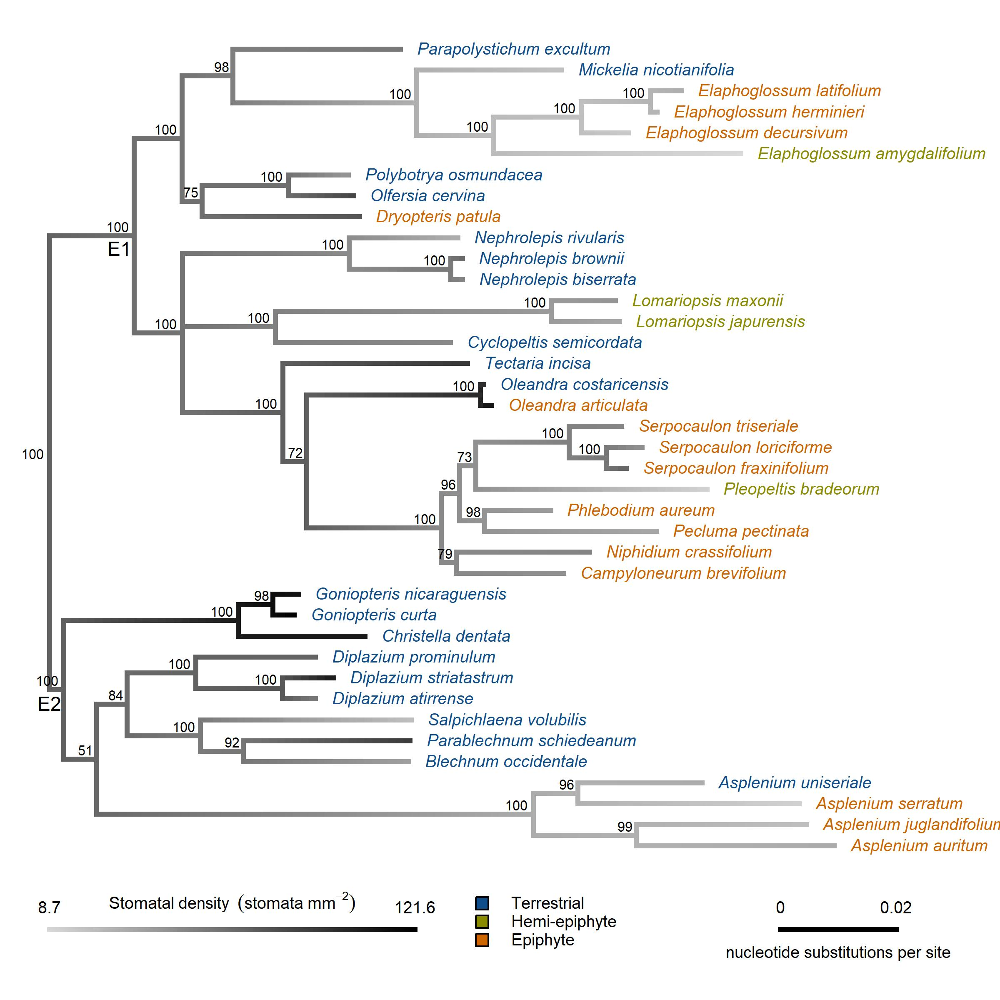

\
Courtney E. Campany^1,2^, Jarmila Pittermann^3^, Alex Baer^3^, Helen Holmlund^4^, Eric Schuettpelz^5^, Klaus Mehltreter^6^ and James E. Watkins Jr. ^1^

\
^1^ Department of Biology, Shepherd University, Shepherdstown, WV, USA

\
^2^ Department of Biology, Colgate University, Hamilton, NY, USA

\
^3^ Department of Ecology and Evolutionary Biology, University of California, Santa Cruz, CA, USA

\
^4^ Natural Science Division, Pepperdine University, Malibu, CA, USA

\
^5^ Department of Botany, National Museum of Natural History, Smithsonian Institution, Washington D.C., USA

\
^6^ Red de Ecología Funcional, Instituto de Ecología A.C. Veracruz, México

\
**Corresponding author:** C.E. Campany, email: courtneycampany@gmail.com 

\
**Running Head:** Terrestrial and epiphytic fern functional traits

```{r, results="asis", echo=FALSE, warning=FALSE}
library(knitr)
opts_knit$set(root.dir = '../')
```

```{r global data/sourcing, echo=FALSE, message=FALSE, warning=FALSE}
# Set Flag to include figures in text or not.
includeFigs <- TRUE
```

# Abstract

Opportunistic diversification has allowed ferns to radiate into epiphytic niches created by angiosperm dominated landscapes. Our understanding of how ecophysiological function allowed radiation into the canopy habitat and the potential transitionary role of the hemi-epiphytic life form remains unclear. We surveyed 39 fern species in Costa Rican tropical forests to explore epiphytic trait divergence in a phylogenetic context. We examined leaf responses to water deficit in terrestrial, hemi-epiphytic and epiphytic ferns and related these findings to functional traits that regulate leaf water status and mineral nutrition. Epiphytic ferns had reduced xylem area (-60%), shorter stipe lengths (-54%), thicker lamina (+67%) and reduced stomatal density compared to terrestrial ferns (-51%). Surprisingly, epiphytic ferns exhibiting similar turgor loss points, higher osmotic potential and lower tissue capacitance than terrestrial ferns. Overall, hemi-epiphytic ferns exhibit traits that share functional relevance with both terrestrial and epiphytic species. Our findings clearly demonstrate the prevalence of water conservatism in both epiphytic and hemi-epiphytic ferns, via selection of anatomical and structural traits that avoid leaf water stress. Even with canalized physiological function, adaptations for drought avoidance have allowed epiphytic ferns to successfully endure the stresses of the epiphytic habitat.

\
**Key Words:** epiphyte, fern, functional traits, hemi-epiphyte, stomata, turgor loss 

# Introduction

Following the rise of angiosperms, a major radiation event in ferns occurred in the Cretaceous period that led to the diversification and proliferation of modern fern taxa [@schuettpelz_evidence_2009]. Globally, fern species thrive and serve important ecological roles in shaded understory environments [@bazzaz_physiological_1980; @george_fern_1999; @coomes_hare_2005]. However, part of the large Cretaceous radiation event in tropical ferns included opportunistic diversification into more complex niches provided by emergent angiosperm canopies [@schneider_ferns_2004]. Consequently, one clade of ferns (Eupolypod I) has largely radiated into epiphytic niches, while a sister clade (Eupolypod II) remained and diversified on the forest floor in tropical ecosystems [@watkins_ferns_2012]. Extant ferns and orchids are now the predominant tropical vascular epiphytes and ferns account for eight of the largest epiphyte genera [@gentry_diversity_1987; @cardelus_vascular_2006]. Importantly, epiphytes may be vulnerable to global change factors because they reside at an interesting interface of vegetation and the atmosphere, but evolutionary selection of tolerance mechanisms in epiphytic species may dampen this projection [@colwell_global_2008; @zotz_epiphytic_2009; @gotsch_life_2015].

\
Epiphytic tropical ferns grow across a continuum of canopy positions, from heavily shaded low trunk positions to exposed upper canopy branches of trees [@watkins_ferns_2012]. A hemi-epiphytic life form also exists in tropical ferns, with germination and establishment as an epiphyte that eventually establishes a terrestrial root-soil connection [@moffett_whats_2000; @zotz_hemiepiphyte_2013]. Consequently, the ecophysiology of all epiphytic ferns (and likely to some degree hemi-epiphytes) is moderated by inconsistent availability of irradiance, mineral nutrition and water [@luttge_vascular_2012]. For example, vapor pressure deficit, light exposure and wind speed fluctuate with canopy position and size of tropical trees [@cardelus_vascular_2006; @watkins_hydraulic_2010; @lowman_plant_2012;  @woods_microhabitat_2015], nitrogen and phosphorus availability can be limited to foliar leaching and highly variable canopy soil [@cardelus_nutrient_2010] and water supply can be negatively impacted by the lack of soil connections, even with ample precipitation [@gotsch_life_2015]. The resulting micro-habitats for epiphytic fern species are undoubtedly distinct from habitats that terrestrial ferns inhabit. Therefore, evolutionary selection of physiological and anatomical traits to adapt to these variable environmental conditions should have coincided with the opportunistic diversification of ferns into new epiphytic niches.
  
\
The ecological stresses of the epiphytic habitat have likely driven selection for traits realted to water deficit for all residing vascular and non-vascular plant lineages. For example, epiphytic angiosperms exhibit high adaptive capacity to maintain leaf water balance, including both drought tolerance and avoidance mechanisms, tank water storage, foliar water uptake and shifts in leaf capacitance [@benzing_foliar_1970; @gotsch_life_2015; @zotz2016plants; @north_hydraulic_2019]. Alternatively, it is now generally accepted that seed-free vascular plant lineages (including ferns) exhibit evolutionary canalization of physiological function that may inhibit their plasticity to changing environmental conditions. For example, evolutionary canalized passive stomatal control has been reported several times in ferns species [@brodribb_passive_2011; @ruszala_land_2011; @mcadam_fern_2012; @cardoso_hydraulics_2019], suggesting that ferns possess a diminished capacity to optimize water-use efficiency [@brodribb_evolution_2009]. A suite of studies also reveal how anatomical traits directly influence physiology in ferns in a manner that is functionally different from seed plants [@woodhouse_stipe_1982; @zhang_epiphytes_2009; @brodribb_leaf_2005;@pittermann_structure-function_2011; @brodersen_physiological_2012; @baer_not_2016]. Even through a 1/3 of tropical fern species have diversified into tree canopies [@schuettpelz_evidence_2009], our understanding of how potentially limiting plasticity in ecophysiological function has still resulted in such a massive diversification is surprisingly unclear. 

\
Compared to terrestrial habitats, ferns in epiphytic habitats should exhibit 
variation in anatomical and biomechanical traits to cope with drought stress [e.g. high light, high VPD & variable access to water [@saldana_ecophysiological_2005; @kessler_patterns_2007; @watkins_ecological_2007; @nishida_photosynthetic_2017]. Water transport in ferns occurs exclusively through hydraulically efficient primary vascular tissue, with xylem that exhibits a broad range of cavitation resistance [@pittermann_structure-function_2011; @watkins_hydraulic_2010]. Ferns have also been shown to have higher hydraulic safety margins than angiosperms, resulting from reduced hydraulic conductivity and rapid stomatal closure [@brodribb_stomatal_2004]. In epiphytic ferns, decreased conductivity in the xylem of stipes limits the amount of water supply available to a given leaf area, however this reduction in hydraulic capacity may reduce leaf water loss [@watkins_hydraulic_2010]. Synthesizing these findings in ferns suggests that the evolution of xylem and stomata are likely connected from an ancestral state of water conservatism [@sperry_coordinating_2004], and the more recent diversification of epiphytic ferns allows exploration of the degree to which hydraulic tolerance or avoidance mechanisms manifest in key functional traits. 

\
Adaptations of morphological, anatomical and physiological traits that define plant water relations will be essential in the ecophysiological success of any epiphytic plant, yet our knowledge of how epiphytic fern species maintain plant water balance is currently underdeveloped. This study tests the hypothesis that the evolution of leaf traits typically related to drought tolerance promoted the radiation of ferns from largely moist, terrestrial habitats to far more unpredictable canopy habitats. We examined leaf responses to water deficit across field-sampled terrestrial, hemi-epiphytic and epiphytic ferns in Costa Rican tropical forests and related these data to a suite of anatomical and morphological traits that modulate leaf water status. We focused on a large representation of species from two recent fern lineages, Eupolypods I and Eupolypod II, to explore epiphytic functional trait divergence in a phylogenetic context. We also sought to unpack the transitionary role the hemi-epiphytic life form serves, if any, to the radiation of ferns from terrestrial to epiphytic habitats. 

# Methods

##### Study Site and Species Selection

The sites used for this study included two Costa Rican wet tropical forest locations at La Selva Biological Research Station in Heredia (84⁰00’12W, 10⁰25’52N) and Las Cruces Research Station in San Vito (8° 47′ 7” N, 82° 57′ 32” W). The La Selva site is a low elevation (ca 50 m) tropical forest, with a moderate dry season. The Las Cruces site is a premontane tropical forest located at a higher elevation (ca 1200 m). Both sites receive approximately 4m of annual rainfall [@holdridge_life_1967; @gentry_four_1993].

\
A survey of morphological, stoichiometric, anatomical and leaf water relations parameters were conducted for individuals (n = 6-8) from 39 fern species across three fundamentally distinct life forms (Table S1). Across both sites, 18 terrestrial, 15 epiphytic and 6 hemi-epiphytic species were collected and measured. In this study, terrestrial life forms were all collected from shaded closed canopy understories in the forest floor. Epiphytic life forms were sampled from trunks or within tree canopies, depending on the species. Epiphytic species were collected from tall canopy trees using single-rope climbing techniques, when necessary. Hemi-epiphytic species were collected along lower sections of trees trunks (1-3 m). Importantly, all sampled hemi-epiphytic species are known to have root connections to forest floor soils at some point in their life history. Individuals of species were collected across multiple populations but within similar micro-habitat conditions. All sampled fern species were restricted to the Eupolypod I and II clades. Vouchers for each species were deposited at the respective site of collection at either the La Selva (LSCR) or Las Cruces (LCCR) herbariums. 

##### Plant Material

Two complete fronds from sampled individuals were field collected in the early morning (6-7:30 am). One frond from each individual was utilized for pressure volume curves, while the other was sampled for structural morphology, lamina stoichiometry and anatomical traits. Stipes were cut at the base of the rhizome and cut ends were wrapped in wet paper towels and transported to the lab in black plastic bags. Stipes were re-cut under water and re-hydrated for 1-6 hours. Due to the difficulty in sampling some high canopy species; whole epiphytic individuals were carefully removed, maintained overnight in well-watered conditions in an ambient air laboratory and sampled the following day. 

##### Leaf Morphometric traits

Stipe length (cm) and lamina length (cm) were calculated from one sampled frond per individual. Total frond length was calculated as the sum of stipe and lamina lengths. Total lamina area for each frond was measured with a Li-3100 leaf area meter (LiCor Biosciences, Lincoln, NE, USA). Leaf mass per unit area (LMA, g cm^-2^) was calculated using the tissue punch method. For each individual, ten lamina punches (5 mm^2^) were dried to a constant mass and LMA was calculated as the total dry mass divided by the total area of all leaf punches. 

##### Anatomical traits

Stomatal density (SD) was measured by directly counting stomata on the abaxial leaf surface under 40x magnification. Three leaf punches (4 mm^2^ diameter) were sampled across random locations on different pinnae from each individual. The number of stomata in each field of view were counted in three random regions on each of three leaf punches. The stomatal density (# mm^2^) for each individual is presented as the mean SD across all 9 sampled regions. Individual images of stomata were directly photographed under 40x magnification across all three leaf punches per individual. Stomatal length (mm) and width (mm) of both guard cells were calculated for 9 stomata for each individual using Image J (National Institutes of Health, Bethesda, ML, USA). Stomatal size (SS, mm^2^) was calculated as guard cell length multiplied by the combined width of each guard cell pair, as in @franks_maximum_2009.

\
Stipes measured for vulnerability to cavitation were transversely sectioned by hand using razor blade. Stipes were sectioned at the distal end, where conduit resistivity impacts hydraulic conductivity the most. Sections were stained in toluidine blue and then mounted in glycerine on microscope slides. Each section was photographed using a light microscope mounted with a digital camera (Amscope FMA050). Section photographs were anatomically analyzed using ImageJ. Total xylem vascular area (mm^2^) was considered the conduit lumen area and the wall area for all xylem in each cross section.

##### Foliar chemistry

Sub-samples of foliage tissue, used for lamina area calculation, were collected across multiple locations on each pinnae for every individual. These sub-samples were dried to a constant mass and ground using a Wig-L-Bug (Sigma-Aldrich Co, St. Louis, MO, USA). Nitrogen content and $\delta$C^13^ were measured using a Delta V isotope ratio mass spectrometer interfaced to a NC2500 elemental analyzer (Thermo Scientific, Waltham, MA, USA) and corrected by comparison with certified standards. 

\
Lamina chlorophyll content was determined on three different pinnae for each individual. Single point measurements of chlorophyll content (mg m^-2^) were measured within a 3 mm diameter circle with the CCM-300 chlorophyll content meter (Opti-Sciences, Hudson, NH, USA). Chlorophyll content per individual is expressed as the mean of point measurements across the entire frond.

##### Pressure-volume relations

Tissue-water relations were determined with pressure–volume analysis [@tyree_measurement_1972] on fully expanded fronds with a Scholander pressure bomb (PMS Instruments Co., Corvallis, OR, USA). For each pressure-volume (PV) curve, we sampled the top most intact pinnae after full re-hydration. We generated pressure–volume curves by taking sequential water potential measurements ($\psi$~leaf~) as fronds air dried, first in closed plastic bags (0-3 hrs), and then in open air. The fresh mass was recorded immediately before and after each $\psi$ determination. Following each PV curve, foliar samples were dried to a constant mass to calculate relative water content. For each PV curve, we graphed the relationship between 1/$\psi$~leaf~ and leaf mass to estimate parameters related to leaf turgor and bulk tissue water relations. We then calculated leaf water potential at turgor loss ($\psi$~tlp~), the osmotic potential at full tissue hydration ($\psi$~o~), the bulk modulus of tissue elasticity ($\epsilon$) and tissue capacitance (C) according to @sack_prometheuswiki_2011. 
 
##### Statistical analysis

Linear mixed-effect models were used to test responses of functional traits to categorical fixed effects of life form and collection site, as well as to test for bivariate relationships among key functional traits. The interaction between life form and collection site was tested to confirm any potential environmental or climate influence on functional trait patterns. Generally, there were few life form x collection site interactions, so models with life form and collection site as main effects were compared to full models (AIC scores) and the most parsimonious model was selected. To test for broad differences among life forms, individual plant species were treated as random effects in each model. Tukey’s post-hoc test were performed in conjunction with ANOVA to determine which mean values of functional traits were different among fixed effect treatments with the ‘multcomp’ package [@hothorn_simultaneous_2008]. We utilized a type 3 ANOVA due to an unbalanced design with the limited number of hemi-epiphytes species available. If interactions were present, we computed pairwise comparisons with the ‘emmeans’ package [@lenth_emmeans_2018] to investigate interactions between trait relationships and life form. For mixed-effect models, the conditional and marginal R^2^ values were calculated as per @nakagawa_general_2013. Tests of differences in slopes and elevations of bivariate relationships between functional traits were implemented using standardized major axis regression in the 'smatr' package in R [@warton_smatr_2012]. 

\
A phylogenetic tree for these 39 fern species was constructed using the Maximum Likelihood method based on the Tamura 3-parameter model [@tamura_estimation_1992] and all evolutionary analyses were conducted in MEGA7 [@kumar_mega7_2016]. For each taxon, previously published sequences were obtained from GenBank (Table S1). In eight instances, it was necessary to use sequences from a closely-related species in the same genus as due suitable sequences from the focal species were unavailable. The tree was rooted with a single included representative of the *Dennstaedtiaceae*, *D. dissecta*. We first selected the best model of nucleotide substitution with jModelTest2 (default parameters) using both Akaike and Bayesian information criteria (AIC and BIC). The selected model was GTR+G+I (lset nst=6 rates=invgamma). We used Bayesian Inference in MrBayes to analyze sequence data [@huelsenbeck_mrbayes_2001; @ronquist_mrbayes_2003]. Two runs of four Markov Chain Monte Carlo (MCMC) chains (3 “heated” and 1 “cold”) were run in parallel in MrBayes for 1 × 10^6^ generations and sampled every 5000 generations. Tracer (shape of the trace + effective sample size (ESS) > 200) as well as the standard deviation of split frequencies (<0.01) were used to assess stationarity of the Markov chains.

<!-- (mcmc ngen=1000000 samplefreq=500 printfreq=500 diagnfreq=5000) -->

\
The phylogenetic signal (K-statistic) based on Brownian motion-based metrics was calculated for each continuous trait using the ‘picante’ package in R [@kembel_picante_2010]. Values of 'K' for a given trait that are below 1 mean that relatives resemble one another less than we would expect for Brownian motion (lower phylogenetic signal), and vice versa for values of 'K' above 1 [@blomberg_testing_2003]. Significant *P* values for 'K' indicates that close relatives are more similar than random species pairs for the given trait. Additionally, bivariate relationships among mean species values of continuous traits were analyzed with phylogenetically independent contrasts (PIC) in the 'ape' package in R [@paradis_ape_2019] to correct for possible non-independence resulting from phylogeny [@felsenstein_phylogenies_1985]. All PIC analyses were directly compared with the results of conventional ANOVA (described above) to better understand the functional and evolutionary relationships between traits. All tests of statistical significance were conducted at an $\alpha$ level of 0.05 and means&pm;SE are reported for data not presented in figures. All analyses were performed with R 4.0.0 [@team_r_2013].

# Results

##### Frond morphology and anatomy

Total frond length was reduced by 26 % in epiphytic (59&pm;2.5 cm) compared to terrestrial (85&pm;3.3 cm) species, with frond length of hemi-epiphytes an intermediate between both groups (*P* = 0.021). The reduction in total frond length was driven by a large reduction (-54 %) in stipe length in epiphytic compared to terrestrial species (*P* = 0.001, Figure 1A). The majority of epiphytic and hemi-epiphytic ferns had stipes restricted to less than 20 cm (80 % quantile), while maximum stipe length of terrestrial ferns from the same probability distribution was 42.3 cm. Allometric relationships between stipe length and lamina area were functionally different between epiphytic species compared to terrestrial and hemi-epiphytic species (Figure 1B, stipe length x life form; *P* = 0.002). Log relationships of stipe length and lamina area were positively correlated for each life form, however, pair wise differences were detected in both the slopes (*P* < 0.001) and elevation (*P* < 0.001) of this structural relationship for epiphytic species. Phylogenetic independent contrasts support the positive relationship between stipe length and lamina area for measured species (*P* < 0.001, R^2^ = 0.46).

\
Total xylem area was 60 % smaller in epiphytic and hemi-epiphytic species compared to terrestrial species (*P* = 0.003). The standardized leaf xylem fraction, calculated as the ratio of xylem area to lamina area, was similarly smaller in epiphytic and hemi-epiphytic species (*P* < 0.001, Figure 2A). Increases in stipe length were positively correlated with increases in total xylem area across all life forms (*P* < 0.001). Pair-wise differences were detected for the slopes (*P* < 0.001) of this positive relationship between stipe length and xylem area across life forms, while elevations were similar (Figure 2B). Phylogenetic independent contrasts support the positive relationship between xylem area and stipe length for measured species (*P* < 0.001, R^2^ = 0.26).

\
No statistical differences were detected in total lamina area between any of the life form groups, due to the large amount of variation in lamina area across species (R^2^ marginal = 0.17 and R^2^ conditional = 0.89). However, leaf mass per unit area (LMA) was 67 % higher in epiphytic compared to terrestrial species, with hemi-epiphytic species intermediates between both life forms (*P* = 0.002, Figure 3A). Broadly, leaf thickness of terrestrial and hemi-epiphytic ferns was constrained to less than 300 g m^-2^, while epiphytic ferns species were capable of much higher values.

##### Foliar chemistry 

Lamina nitrogen content (*N*) was 30 % lower in epiphytic ferns compared to terrestrial and hemi-epiphytic ferns (*P* = 0.007). *N* on a mass basis decreased with increases in LMA for terrestrial and hemi-epiphytic species, but not for epiphytic species (LMA x life form *P* < 0.001). Slopes and elevations of the significant relationship between *N* and LMA varied across life forms (Figure 3C). Phylogenetic independent contrasts, however, did not detect a relationship between *N* and LMA. Additionally, lamina $\delta$^13^C for terrestrial and hemi-epiphytic species was more negative that epiphytic species (*P* = 0.004, Figure 3B). Lamina $\delta$^13^C for fern species at the higher elevation Las Cruces site was also less negative (-33.0&pm;0.26 &permil;) than fern species at the low elevation La Selva site (34.0&pm;0.15 &permil;, *P* = 0.015).

\
Total chlorophyll content was similar between terrestrial and epiphytic species, although epiphytic species had a lower possible range of chlorophyll content (Figure S1). Hemi-epiphytic species had similar chlorophyll content to terrestrial species, but were 37 % higher than epiphytic species (*P* = 0.031).

##### Stomatal anatomy

Epiphytic and hemi-epiphytic species had 51 % lower stomatal density compared to terrestrial species (Figure 4A, *P* < 0.001). The majority of epiphytic and hemi-epiphytic ferns had stomatal density restricted to fewer than 55 per mm^2^ (80 % quantile), while stomatal density of terrestrial ferns from the same probability distribution was 105 per mm^2^. Stomata of epiphytic species were 10.4 % larger in epiphytes compared to terrestrial species, with hemi-epiphytes intermediates between both life forms (Figure 4B, *P* = 0.037). Differences in stomatal size were driven by 16.0 % greater guard cell width in epiphytes and hemi-epiphytes (13.4&pm;0.18 um) compared to terrestrial species (11.2&pm;0.21 um, *P* = 0.002). Guard cell length was statistically similar across life forms (47.7&pm;0.45 um). A linear mixed model of the relationship between between stomatal density and stomatal size was not significant, largely due to the large amount of variation present in the random effect of species. Increases in stomatal density were negatively correlated with stomatal size only when fern life forms where assessed individually (Figure S2). Phylogenetic independent contrasts did support the negative relationship between stomatal density and stomatal size for measured species (*P* = 0.006, R^2^ = 0.17).

##### Leaf pressure-volume traits

Minimal differences in leaf pressure-volume parameters were detected among the three fern life forms (Figure 5A). The turgor loss point ($\Pi$~tlp~) varied by life form (*P* = 0.042), however, post-hoc multiple comparisons did not detect differences in $\Psi$~tlp~ across terrestrial, hemi-epiphytic or epiphytic ferns. Broadly, terrestrial and hemi-epiphytic fern species had slightly lower $\Psi$~tlp~ than epiphytic species (Figure 5B). The osmotic potential ($\Psi$~o~) was also lower in terrestrial and hemi-epiphytic species (*P* = 0.009, Figure 5C), while the modulus of elasticity ($\epsilon$) was similar across all life forms. The relative water content at turgor loss point did not vary between fern life forms. Additionally, tissue capacitance at full turgor (*C~f~*) declined quickly with increasing $\epsilon$ for all species and the tissue capacitance at the turgor loss point (*C~TLP~*) was 54 % lower in epiphytic compared to terrestrial species (*P* = 0.010, Figure 5D).

##### Functional trait evolution

The degree to which a phylogenetic signal (K-statistic) was expressed in the functional traits for these tropical ferns species was generally low (Table 1). A significant phylogenetic signal was detected for stomatal traits and a few leaf traits, but was not apparent in morphological, anatomical, chemical or isotopic  traits. Broadly, this suggests that the measured trait phenotypes of surveyed species resembled each other less than expected under Brownian motion evolution.

\
Ancestral state reconstructions also elucidated how tropical fern character states derived from terrestrial origins were adapted under selection pressures from new and distinct epiphytic environments within the Eupolypod clades. The selection for shorter stipes can be seen in divergence of both epiphytic and hemi-epiphytic species on the phylogeny (Figure 6). The selection for fewer stomata is also readily apparent in epiphytic species divergence, especially in the Eupolypods II clade (Figure 7). Additionally, the emergence of thick leaves (&uarr; LMA) and the reduction of total xylem area is almost entirely constrained to radiation events of epiphytic species examined in this study (Figure S3 & S4). 

# Discussion

This study sought to provide new insight on the mechanisms by which ferns, with potentially limited plasticity in ecophysiological function, successfully diversified  into epiphytic habitats. Our results suggest that adaptations of functional traits related to avoidance of water stress (e.g. &uarr; LMA & &darr; stomatal density), instead of tolerance, allowed the radiation of ferns into more variable canopy habitats. Although the role of hemi-epiphytic species in this radiation remains uncertain, we provide additional evidence to help understand the evolutionary origins of this life form. Epiphytic ferns have been previously been shown to be consistently smaller than terrestrial ferns [@testo_are_2018; @nitta_life_2020]. Here, we examine a suite of traits and biomechanical relationships related to leaf water relations that likely underpin this reduction in size.

##### Anatomical and biomechanical traits regulate how epiphytic ferns thrive in sub-optimal resource environments

Tropical epiphytic ferns routinely face environmental conditions that are distinct from the forest floor. Despite large annual precipitation, epiphytic ferns without a root-soil connection face selection pressures from a transient water supply. In conjunction with limited access to elemental nutrients, epiphytic ferns must adapt functional traits to optimize both nutrient retention and efficient hydraulic transport. The evolution of these traits would have been essential to maintain a positive carbon balance as ferns radiated into the canopy niche. Here, evidence of the selection of both reduced xylem area and stipe length for water transport is evident across the diversification of epiphytic and hemi-epiphytic ferns in our studied species. Additionally, the selection of thick lamina (&uparrow; LMA) is readily apparent in the diversification of epiphytic ferns. Evaluating why these structural traits evolved requires unpacking the role of each trait in the biomechanics of form and function of epiphytic ferns.

\
Differences in trait coordination related to biomechanical and structural support have previously been detected between epiphytic and terrestrial ferns [@peppe_biomechanical_2014; @mahley_geometry_2018], creating potential trade-offs to leaf water supply. Ferns also rely entirely on primary xylem [@pittermann_structure_2015; @nitta_life_2020] and limited leaf venation [@brodribb_leaf_2007] to supply lamina tissues, thereby constraining frond morphology and leaf hydraulic function [@pittermann_structure-function_2011; @pittermann_physiological_2013]. Our results build on these findings by elucidating additional differing allometric relationships between epiphytic and terrestrial tropical ferns. Many epiphytes were capable of supporting equally large lamina as terrestrial species with short or minimal stipes. Positive relationships between xylem area and stipe length were thus functionally distinct in epiphytes due to large reductions in both traits. The reductions in investment to leaf water supply (xylem fraction) appear buffered by coinciding reductions in hydraulic path length, allowing support of large lamina with reduced total frond length (smaller size) in epiphytic ferns. These shifts in frond structure and anatomy represent adaptations to maintain positive water balance for lamina structural integrity and gas exchange and are realized by a greater water use efficiency (less negative lamina $\delta$^13^C) detected in epiphytic ferns.

\
Plant species adapted to low resource supplies tend to invest in higher LMA and to maintain leaves longer into periods of scarcity [@wright_worldwide_2004]. The radiation of ferns into tropical canopy niches included the adaptation of thick lamina, which may have been exacerbated in ferns compared to other epiphytic groups. For example, leaf dry matter content (a component of LMA) was found to be twice as high in epiphytic ferns compared to other taxonomic groups of epiphytes [@petter_functional_2016]. The benefits of higher LMA for tropical epiphytes likely centers on improved water retention [@watkins_influence_2007; @zhang_differentiation_2015] and leaf persistence [@reich_leaf_1991], but may come at the consequence of resource utilization and photosynthetic capacity. Globally, mass based *N* investment decreases in plants as LMA increases [@wright_worldwide_2004]. Similar relationships between nitrogen and LMA can be inferred in tropical understory ferns from several studies [@karst_are_2007; @campany_convergence_2019] and from the data presented here. This relationship appears to become uncoupled in epiphytic ferns, however, largely due to the extremely high values of LMA produced in many species of epiphytic ferns (Figure 3C). This decoupling may help explain the comparatively low rates of photosynthesis reported in epiphytic ferns and provide further support for the evolution of leaf traits adapted for water conservation [@zhang_epiphytes_2009; @zhang_leaf_2014].

##### Does canalized physiological function underpin drought avoidance?

Surprisingly, we detected few intrinsic differences in leaf water relations between terrestrial and epiphytic species. Epiphytic ferns had slightly more sensitive $\Psi$~tlp~ than terrestrial ferns, which can be explained by several components of tissue water potential. Epiphytic ferns were less capable of osmotic adjustments (less negative $\Psi$~o~) than terrestrial ferns and did not exhibit adaptations of cell wall elasticity ($\epsilon$). Across all surveyed species, the ability to store water declined quickly with decreases in cell wall elasticity (&darr; $\epsilon$). Furthermore, the water storage capacity at turgor loss points (*C~TLP~*) of epiphytic ferns was far lower than in terrestrial ferns. Combined, we detected no detected no specific traits associated with drought tolerance in epiphytic ferns. 

\
The water potential at turgor loss point ($\Psi$~TLP~) has been found to be an indicator of drought tolerance across a wide range of plants and ecosystems [@bartlett_determinants_2012]. Drought tolerance mechanisms have been previously studied in epiphytes but largely focus on angiosperm species. Tropical angiosperms epiphytes were shown to adjust osmotic potentials and sap flow to seasonal climate [@gotsch_variation_2018], having more negative $\Psi$~TLP~ in wet and dry seasons than the epiphytic fern species in this study. Our evidence suggests that epiphytic ferns have not evolved traits to be tolerant of water stress, in contrast to their epiphytic angiosperms neighbors. This is confirmed by a study by @martin_causes_2004 which also detected relatively high osmotic potentials (~1.0 MPa) in epiphytic ferns and lycophytes.

\
Evidence now strongly suggests that passive stomatal function persists in fern evolution, compared to the development of active stomata control in seed plant taxa [@brodribb_passive_2011; @ruszala_land_2011; @mcadam_fern_2012; @cardoso_hydraulics_2019], limiting the leaf water potential margin between stomatal closure and leaf death via water stress [@zhang_leaf_2014]. Therefore, we evaluated whether plasticity in stomatal traits could explain the water conservation strategies observed in epiphytic ferns (i.e. lack of apparent drought tolerance). Stomatal anatomical traits have been shown to exhibit a wide range of inter-specific variability among understory tropical ferns [@campany_convergence_2019] and epiphytic ferns [@hietz_correlation_1998] and between epiphytic and tropical ferns in a tropical common garden [@zhang_leaf_2014]. Synthesizing findings from these studies with our data reveals a broad pattern of decreased stomatal density (approx. 2.5 fold) in epiphytic compared to terrestrial tropical ferns. Patterns in stomatal size are less clear, but do suggest slightly larger stomatal size in fern epiphytes. The stomata of ferns have been shown to close rapidly to changes in vapor pressure difference, despite hydro-passive regulation, compared to angiosperms [@mcadam_evolution_2015] and ferns close stomata at very low levels of water stress [@brodribb_stomatal_2004; @mcadam_ancestral_2013]. To persist in epiphytic niches characterized by inconsistent water supply, reduced stomatal density likely allowed ferns to minimize variable exposure to water stress. Overall, the derived nature of functional traits seen in the radiation of epiphytic ferns (&darr; stomatal density, &darr; xylem area with &darr; stipe lengths and &uarr; LMA) reveal strategies for avoidance of low leaf water potentials. Although this water conservatism reduces photosynthetic potential [@mcelwain_ferns_2011], it likely represents an evolutionary drought avoidance pathway that allowed the impressive diversification of epiphytic ferns.

##### The role of hemi-epiphytic life-forms in the evolution of epiphytism in ferns

Understanding the evolutionary role of hemi-epiphytic ferns in the radiation of tropical ferns into epiphytic niches is complicated by the limited total species diversity available to measure [see @putz_notes_1986; @gentry_contribution_1987; @testo_primary_2014]. Our constructed phylogenies suggest both terrestrial and epiphytic ancestors for the surveyed hemi-epiphytic ferns species, but this should be taken with caution due to low diversity. Hemi-epiphytic species share characteristics of both terrestrial and epiphytic life forms [@watkins_hydraulic_2010], however, similarity in trait function does provide evidence of the transitionary role of the hemi-epiphytic life form. The morphological construction of fronds in hemi-epiphytic species resemble those of terrestrial ferns. Similarity in structural allometry (stipe - lamina) and LMA in hemi-epiphytic and terrestrial ferns suggests that hemi-epiphytic species optimize functional traits for a low-light environment with an established root-soil connection. This terrestrial-centric trait optimization is also apparent in the comparable mineral nutrition (foliar N content) and lamina water-use efficiency ($\delta$^13^C) of hemi-epiphytic and terrestrial fern species. Overall, these similarities should not be surprising if the root-soil connection in hemi-epiphytic species is established early in their sporophytic life history. However, if these morphological and stoichiometric traits are optimized differently in life stages of hemi-epiphytic fern species with or without a root-soil connection is still unknown. As such, the plasticity in trait function as hemi-epiphytic fern sporophytes first establish and then develop soil connections should be investigated further.

\
Alternatively, hemi-epiphytic ferns express traits associated with avoiding water stress that more closely resemble epiphytic ferns. Reductions of both stipe length and total xylem area in hemi-epiphytic ferns suggest that adaptations to reduced water availability in their early establishment as epiphytes are likely conserved throughout their life history. Similarly, decreases in stomatal density for hemi-epiphytes mirror adaptations for water conservatism detected in epiphytic ferns. The evolutionary origins of hemi-epiphytic species remains unclear, but our data do suggest that 'epiphytic-like' traits optimized to avoid desiccation are likely maintained even when hemi-epiphytic ferns establish a permanent connection with a terrestrial water supply. This could suggest an holoepiphytic origin of extant hemi-epiphytic ferns, agreeing with @testo_primary_2014, which could be further elucidated when plasticity of functional traits in the early establishing sporophyte (as an epiphyte) are better understood.

##### Conclusions

The variation in growing sites and the different types of inhabited vegetation reveal that there is not a simple definition of the ‘epiphytic habitat’ nor of the environmental conditions faced by epiphytic species [@zotz_physiological_2001]. However, scarcity of water is likely the most impactful constraint on epiphytic plants, as most epiphytes receive 'pulse supplied" water without access to soil [@benzing_1990; @zotz_physiological_2001]. The plasticity of functional traits between epiphytic and terrestrial ferns and the reconstructions of trait evolution presented here reveal how tropical ferns were likely able to opportunistically diversify into the canopy habitat.
Although research comparing the ecophysiology of different epiphytic plant lineages, such as orchids and bromeliads would add to our understanding of the evolution of epiphytism, it appears that ferns and angiosperms living side by side on canopy branches likely utilize distinct strategies to deal with water stress.

# Tables

Table 1. Phylogenetic signal for 15 functional traits of tropical ferns sampled across the Eupolypoid I & II clades. Measured species (n=39) encompass terrestrial, hemi-epiphytic and epiphytic habitats across two Costa Rican forest sites.

```{r table1, echo=FALSE, warning=FALSE, message=FALSE}
library(pixiedust)
table1 <- read.csv("calculated_data/K_statistic_traits.csv")
table1_new <- table1[-c(3:4,6),c(6,1,4)]


dust(table1_new)%>%
  sprinkle_colnames("Functional Trait", "K-statistic", "*P*") %>%
  sprinkle(rows= 1, part="head",bold=TRUE)%>%
  sprinkle_print_method("markdown")
```

# Figures

```{r figure1,  echo=FALSE, fig.width = 12, fig.height = 6, warning=FALSE, message=FALSE}
source("master_scripts/figure_1.R")

```
Figure 1. Structural shifts in path lengths to transport water, via stipe length, alters how tropical fern life forms build conductive structures. (A) Box plots of stipe length across tropical fern life forms. (B) Lamina area in tropical ferns is positively related to stipe length (log-based) and this relationship varies by life form. The width of box plots are drawn proportional to the number of measured species in each life form. Significant log-linear fits for each life from are shown with dashed lines. The conditional and marginal R^2^ for the overall allometric relationship are reported.

\

```{r figure2,  echo=FALSE, fig.width = 12, fig.height = 6, warning=FALSE}
source("master_scripts/figure2.R")
```
Figure 2. Conductive hydraulic supply, via total xylem area, constrains stipe length in tropical fern species. (A) Box plots of xylem fraction (total xylem area (mm^2^):lamina area (mm^2^)) across tropical fern life forms. (B) The capacity for greater total xylem area in terrestrial tropical ferns supports construction of large stipes. The width of box plots are drawn proportional to the number of measured species in each life form. Significant linear relationships for each life from are shown with dashed lines representing model fits and gray shaded areas as 95 % confidence intervals for the mean. The conditional and marginal R^2^ for the overall linear relationship are reported.

\

```{r figure3,  echo=FALSE, fig.width = 8, fig.height = 8, warning=FALSE, message=FALSE}
source("master_scripts/figure3.R")

```
Figure 3. Shifts in lamina thickness (LMA) and lamina chemistry differ between tropical fern life forms. (A) Box plots of leaf mass per unit area (LMA) and (B) lamina $\delta$^13^C across tropical fern life forms (higher values indicate higher water-use efficiency) across tropical fern life forms. (C) Negative relationships (log-based) between mass-based lamina nitrogen content and LMA for ferns in this study compared to the GLOPNET data set [@wright_worldwide_2004]. The width of box plots are drawn proportional to the number of measured species in each life form. Significant log-linear fits for each life from are shown with dashed lines. The conditional and marginal R^2^ for the overall allometric relationship are reported.

\

```{r figure4,  echo=FALSE, fig.width = 12, fig.height = 6, warning=FALSE, message=FALSE}

source("master_scripts/figure4.R")

```
Figure 4. Stomatal traits differed between tropical fern life forms. (A) Box plots of stomatal density and (B) stomatal size across tropical fern life forms. The width of box plots are drawn proportional to the number of measured species in each life form.

<!-- Significant linear relationships for each life from are shown with dashed lines representing model fits and gray shaded areas as 95 % confidence intervals for the mean. The conditional and marginal R^2^ for the overall linear relationship is reported. -->

\

```{r figure5,  echo=FALSE, fig.width = 12, fig.height = 12, warning=FALSE, message=FALSE}
source("master_scripts/figure5.R")

```
Figure 5. Epiphytic tropical ferns are not more drought tolerant than terrestrial or hemi-epiphytic tropical ferns. (A) Raw results from 211 pressure volume curves from 38 tropical fern species.  Box plots of turgor loss point (B) and osmotic potential (C) across tropical fern life forms. Relationship between tissue capacitance at full turgor and the bulk modulus of elasticity for tropical ferns (D) and box plots of the tissue capacitance at turgor loss point (inset). Fits for panels A,D for each fern life form uses loess regression for visualization purposes. The width of box plots are drawn proportional to the number of measured species in each life form.

\


\
Figure 6. Ancestral state reconstruction for stipe length mapped onto the phylogeny of the selected ferns examined in this study. A posterior probability is indicated at each node.

\


\
Figure 7. Ancestral state reconstruction for stomatal density mapped onto the phylogeny of the selected ferns examined in this study. A posterior probability is indicated at each node.

# Supplementary Information

Table S1. List of fern species examined in this study, included the clade to which they belong, the field site where they were sampled, their life form and GenBank information used to build the phylogeny.

```{r tableS1, echo=FALSE, warning=FALSE, message=FALSE}
library(pixiedust)
tableS1 <- read.csv("master_scripts/species_list_supp.csv")

dust(tableS1)%>%
  sprinkle(rows= 1, part="head",bold=TRUE)%>%
  sprinkle_font(cols=1:2, part="body",italic=TRUE)%>%
  sprinkle_print_method("markdown")
```

\

```{r figureS1,  echo=FALSE,fig.width = 4, fig.height = 4, warning=FALSE, message=FALSE}
source("master_scripts/figureS1_chlorophyll.R")

```
\
Figure S1. Box plots of total chlorophyll content across tropical fern life forms. The width of box plots are drawn proportional to the number of measured species in each life form.

\

```{r figureS2,  echo=FALSE,fig.width = 4, fig.height = 4, warning=FALSE, message=FALSE}
source("master_scripts/figureS2_stomata.R")

```
\
Figure S2. Stomatal density broadly decreases as stomatal size increases. Significant linear relationships for individual life from are shown with dashed lines representing model fits and gray shaded areas as 95 % confidence intervals for the mean. The conditional and marginal R^2^ for the overall linear relationship are reported.

\


\
Figure S3. Ancestral state reconstruction for leaf mass per unit area (LMA) mapped onto the phylogeny of the selected tropical ferns examined in this study. A posterior probability is indicated at each node.

\


\
Figure S4. Ancestral state reconstruction for total xylem area mapped onto the phylogeny of the selected tropical ferns examined in this study. A posterior probability is indicated at each node. *Pecluma pectinata* was trimmed from the phylogenetic tree due to missing data.

# Acknowledgements

We would like to thank Juliette Bechard, Kathleen Bynon, Luke Calderaro, Christoper Krieg and Alexandra Russell for their hard work in the field and in the lab. We would also like to thank Rodolfo Quiros Flores and Bernal Matarrita Carranza for their organizational support at each OTS field station.

# Funding

This material is based upon work supported by the National Science Foundation under grant no. 1656801

# Bibliography