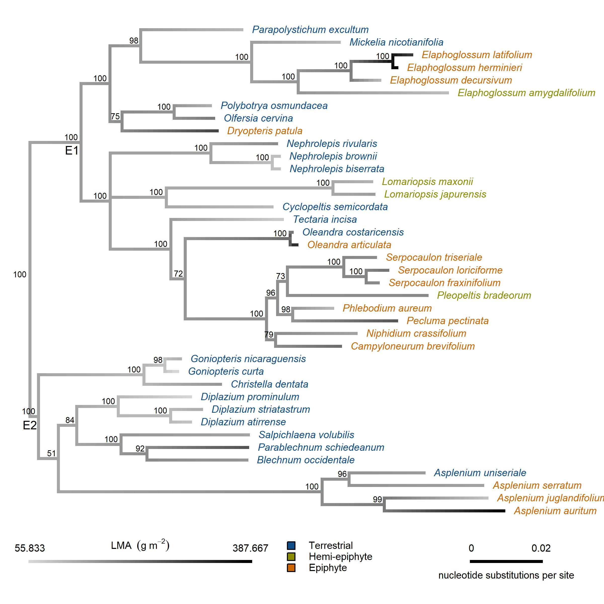
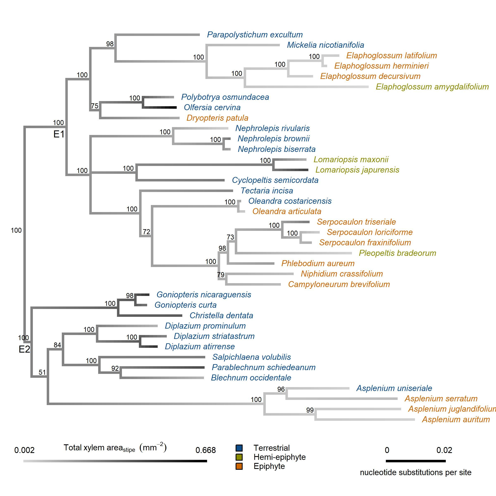

\
Courtney E. Campany^1,2^, Jarmila Pittermann^3^, Alex Baer^3^, Helen Holmlund^4^, Eric Schuettpelz^5^, Klaus Mehltreter^6,7^ and James E. Watkins Jr.^2^

\
^1^ Department of Biology, Shepherd University, Shepherdstown, WV, USA

\
^2^ Department of Biology, Colgate University, Hamilton, NY, USA

\
^3^ Department of Ecology and Evolutionary Biology, University of California, Santa Cruz, CA, USA

\
^4^ Natural Science Division, Pepperdine University, Malibu, CA, USA

\
^5^ Department of Botany, National Museum of Natural History, Smithsonian Institution, Washington D.C., USA

\
^6^ Red de Ecología Funcional, Instituto de Ecología A.C., Xalapa, Veracruz, México

\
^7^ Institute for Systematic Botany and Ecology, University of Ulm, Ulm, Germany 

\
**Corresponding author:** C.E. Campany, email: courtneycampany@gmail.com 

\
**Funding**: This material is based upon work supported by the National Science Foundation grant #IOS-1656876.

<!-- \ -->
<!-- **Running Head:** Terrestrial and epiphytic fern functional traits -->

```{r, results="asis", echo=FALSE, warning=FALSE}
library(knitr)
opts_knit$set(root.dir = '../')
```

```{r global data/sourcing, echo=FALSE, message=FALSE, warning=FALSE}
# Set Flag to include figures in text or not.
includeFigs <- TRUE
```

# Abstract

Opportunistic diversification has allowed ferns to radiate into epiphytic niches in angiosperm dominated landscapes. However, our understanding of how ecophysiological function allowed establishment in the canopy and the potential transitionary role of the hemi-epiphytic life form remain unclear. Here, we surveyed 39 fern species in Costa Rican tropical forests to explore epiphytic trait divergence in a phylogenetic context. We examined leaf responses to water deficit in terrestrial, hemi-epiphytic and epiphytic ferns and related these findings to functional traits that regulate leaf water status and mineral nutrition. Epiphytic ferns had reduced xylem area (-63%), shorter stipe lengths (-56%), thicker lamina (+41%) and reduced stomatal density (-46%) compared to terrestrial ferns. Epiphytic ferns exhibited similar turgor loss points, higher osmotic potential at saturation and lower tissue capacitance after turgor loss than terrestrial ferns. Overall, hemi-epiphytic ferns exhibited traits that share functional relevance with both terrestrial and epiphytic species. Our findings clearly demonstrate the prevalence of water conservatism in both epiphytic and hemi-epiphytic ferns, via selection for anatomical and structural traits that avoid leaf water stress. Even with likely canalized physiological function, adaptations for drought avoidance have allowed epiphytic ferns to successfully endure the stresses of the epiphytic habitat.

\
**Key Words:** epiphyte, fern, functional traits, hemi-epiphyte, stomata, turgor loss, water stress 

\
**Acknowledgments:** We would like to thank Juliette Bechard, Kathleen Bynon, Luke Calderaro, Christoper Krieg and Alexandra Russell for their hard work in the field and in the lab. We would like to thank Rodolfo Quiros Flores and Bernal Matarrita Carranza for their organizational support at each OTS field station. We would also like to thank Caroline Fromont for her advice on building phylogenetic trees. 

# Introduction

Following the rise of angiosperms, a major radiation led to the proliferation of numerous modern fern lineages in the Cenozoic  [@schuettpelz_evidence_2009]. Globally, fern species thrive and serve important ecological roles in shaded understory environments [@bazzaz_physiological_1980; @george_fern_1999; @coomes_hare_2005]. However, part of the large Cenozoic radiation event included opportunistic diversification into more complex niches provided by emergent angiosperm canopies in tropical forests [@schneider_ferns_2004]. Consequently, one large clade of ferns (eupolypods I) has radiated extensively in epiphytic niches, while its sister clade (eupolypods II) mostly remained and diversified on the forest floor in tropical ecosystems [@watkins_ferns_2012]. Along with orchids, extant ferns are now the predominant tropical vascular epiphytes, and ferns account for eight of the largest epiphyte genera [@gentry_diversity_1987; @cardelus_vascular_2006; @zotz2016plants]. Because epiphytes reside at the potentially water-limited interface between vegetation and the atmosphere, they may be especially vulnerable to global change; however, evolutionary selection for tolerance mechanisms in epiphytic species may dampen this projection [@colwell_global_2008; @zotz_epiphytic_2009; @gotsch_life_2015].

\
Epiphytic tropical ferns grow across a continuum of canopy positions, from heavily shaded low trunk positions to exposed upper canopy tree branches [@watkins_ferns_2012]. A hemi-epiphytic life form also exists, with germination and establishment as an epiphyte leading eventually to a terrestrial root-soil connection [@moffett_whats_2000; @zotz_hemiepiphyte_2013]. The ecophysiology of all epiphytic ferns (and likely to some degree hemi-epiphytes) is moderated by the inconsistent availability of irradiance, minerals and water [@luttge_vascular_2012]. For example, vapor pressure deficit, light exposure and wind speed fluctuate with canopy position and size of tropical trees [@cardelus_vascular_2006; @watkins_hydraulic_2010; @lowman_plant_2012;  @woods_microhabitat_2015]; nitrogen and phosphorus availability can be limited to foliar leaching and highly variable canopy soil [@cardelus_nutrient_2010]; and water supply can be negatively impacted by the lack of soil connections, even with ample daily precipitation [@gotsch_life_2015]. The resulting micro-habitats of epiphytic fern species are undoubtedly distinct from habitats that terrestrial ferns inhabit. Therefore, evolutionary selection fpr physiological and anatomical traits to adapt to these variable environmental conditions should have coincided with the opportunistic diversification of ferns into new epiphytic niches. Indeed, @nitta_life_2020 found that, at the community level, epiphytic species were significantly more diverse functionally than terrestrial taxa. 
  
\
The ecological stresses of the epiphytic habitat have likely selected for traits to accommodate water deficit in all residing plant lineages. For example, epiphytic angiosperms exhibit high adaptive capacity to maintain leaf water balance, including both drought tolerance and avoidance mechanisms, tank water storage (in bromeliads), foliar water uptake and higher leaf capacitance [@benzing_foliar_1970; @gotsch_life_2015; @zotz2016plants; @north_hydraulic_2019]. On the surface, seed-free vascular plant lineages (including ferns) appear to present evolutionary canalization of physiological function. For example, passive stomatal control has been reported several times in fern species [@brodribb_passive_2011; @ruszala_land_2011; @mcadam_fern_2012; @cardoso_hydraulics_2019], suggesting that ferns possess a diminished capacity to optimize water-use efficiency [@brodribb_evolution_2009]. A suite of studies also reveals how anatomical traits directly influence physiology in ferns in a manner that is functionally different from seed plants [@woodhouse_stipe_1982; @zhang_epiphytes_2009; @brodribb_leaf_2005;@pittermann_structure-function_2011; @brodersen_physiological_2012; @baer_not_2016]. Recent work has suggested that epiphytic ferns can hold significant yet cryptic community-level functional diversity when compared to terrestrial species [@nitta_life_2020]. Even though more than one third of all tropical fern species have diversified into tree canopies [@schuettpelz_evidence_2009], our understanding of how potentially limiting plasticity in ecophysiological function has still resulted in such a massive diversification is surprisingly unclear. 

\
Compared to terrestrial ferns with more constant water supply, ferns in epiphytic habitats should exhibit variation in anatomical and biomechanical traits to cope with water stress [e.g., high light, high VPD, and variable daily access to water; @saldana_ecophysiological_2005; @kessler_patterns_2007; @watkins_ecological_2007; @nishida_photosynthetic_2017]. Water transport in ferns occurs exclusively through hydraulically efficient primary vascular tissue, with xylem that exhibits a broad range of cavitation resistance [@pittermann_structure-function_2011; @watkins_hydraulic_2010]. Ferns have also been shown to have higher hydraulic safety margins than angiosperms, resulting from reduced hydraulic conductivity and rapid stomatal closure [@brodribb_stomatal_2004]. In epiphytic ferns, decreased conductivity in the xylem of stipes limits the amount of water available to a given leaf area; however, this reduction in hydraulic capacity may reduce leaf water loss [@watkins_hydraulic_2010]. Synthesizing these findings in ferns suggests that the evolution of xylem and stomata are likely connected from an ancestral state of water conservatism [@sperry_coordinating_2004], and the more recent diversification of epiphytic ferns allows exploration of the degree to which dehydration tolerance or avoidance mechanisms manifest in key functional traits. 

\
Adaptations of morphological, anatomical and physiological traits that define plant water relations will be essential in the ecophysiological success of any epiphytic plant, yet our knowledge of how epiphytic fern species maintain plant water balance with inconsistent daily water supply is currently underdeveloped. This study tests the hypothesis that the evolution of leaf traits typically related to drought tolerance promoted the radiation of tropical ferns from largely moist, terrestrial habitats to far more unpredictable canopy habitats. We examined leaf responses to water deficit across field-sampled terrestrial, hemi-epiphytic and epiphytic ferns in Costa Rican tropical forests and related these data to a suite of anatomical and morphological traits that modulate leaf water status. We focused on a large representation of species from two major fern lineages, eupolypods I and II, to explore epiphytic functional trait divergence in a phylogenetic context. We also sought to unpack the transitionary role the hemi-epiphytic life form serves, if any, in the evolution of the epiphytic habit.

# Materials and methods

##### Study site and species selection

The sites used for this study included two wet tropical forest locations in Costa Rica: La Selva Biological Research Station in Heredia (84⁰00’12W, 10⁰25’52N) and Las Cruces Research Station in San Vito (8° 47′ 7” N, 82° 57′ 32” W). The La Selva site is a low elevation (ca 50 m) tropical forest, with a moderate dry season. The Las Cruces site is a premontane tropical forest located at a higher elevation (ca 1200 m). Both sites receive approximately 4000mm of annual rainfall [@holdridge_life_1967; @gentry_four_1993].

\
A suite of morphological, stoichiometric, anatomical and leaf water relation parameters were determined for individuals (n = 6&ndash;8) from 39 fern species representing three fundamentally distinct life forms (Table S1). Across the two sites, 20 terrestrial (including climbing species), 15 epiphytic and 4 hemi-epiphytic species were collected and measured. In this study, terrestrial life forms were all collected from the shaded forest floor in closed canopy understories.  Epiphytic life forms were sampled from trunks (minimum 1 m height) or within tree canopies, depending on the species, using single-rope climbing techniques when necessary. Hemi-epiphytic species were collected along lower sections of tree trunks (1–3 m). Importantly, all sampled hemi-epiphytic species are known to have root connections to forest floor soils at some point in their life history. Individuals of species were collected across multiple populations but within similar micro-habitat conditions. All sampled fern species were restricted to the eupolypods I and II clades. Vouchers for each species were deposited at the respective site of collection at either the La Selva (LSCR) or Las Cruces (LCCR) herbarium.

##### Plant material

Two complete fronds from sampled individuals were field collected in the early morning (6&ndash;7:30 am). One frond from each individual was utilized for pressure volume curves, while the other was sampled for structural morphology, lamina stoichiometry and anatomical traits. Stipes were cut at the base of the rhizome and cut ends were wrapped in wet paper towels and transported to the lab in black plastic bags. Stipes for pressure volume curves were re-cut under water and re-hydrated for 1&ndash;6 hours. Due to the difficulty in sampling some high canopy species, whole epiphytic individuals were carefully removed, maintained overnight in well-watered conditions in an ambient air laboratory and sampled the following day. 

##### Leaf morphometric traits

Stipe length (cm) and lamina length (cm) were measured from one sampled frond per individual. Total frond length was calculated as the sum of stipe and lamina lengths. Total lamina area for each frond was measured with a Li-3100 leaf area meter (LiCor Biosciences, Lincoln, NE, USA). Leaf mass per unit area (LMA, g cm^-2^) was calculated from biopsy punch sub-samples. For each individual, ten lamina punches (5 mm^2^) were dried to a constant mass and LMA was calculated as the total dry mass divided by the total area of all leaf punches. 

##### Anatomical traits

Stomatal density (SD) was measured by directly counting stomata on the abaxial leaf surface under 40x magnification. Three leaf punches (4 mm^2^ diameter) were sampled across different locations on different pinnae from each individual. The number of stomata in each field of view were counted in three regions on each of three leaf punches. The stomatal density (# mm^-2^) for each individual is presented as the mean across all 9 sampled regions. Individual images of stomata were directly photographed under 40x magnification across all three leaf punches per individual. Stomatal length (mm) and width (mm) of both guard cells were calculated for 9 stomata for each individual using ImageJ (National Institutes of Health, Bethesda, ML, USA). Stomatal size (SS, mm^2^) was calculated as guard cell length multiplied by the combined width of each guard cell pair, as in @franks_maximum_2009.

\
Stipes were transversely sectioned by razor blade at the distal end, where conduit resistivity impacts hydraulic conductivity the most. Sections were stained in toluidine blue and then mounted in glycerine on microscope slides. Each section was photographed using a light microscope mounted with a digital camera (Amscope FMA050). Section photographs were anatomically analyzed using ImageJ. Total xylem vascular area (mm^2^) was considered the conduit lumen area and the wall area for all xylem in each cross section.

##### Foliar chemistry

Sub-samples of foliage tissue, used for lamina area calculation, were collected across multiple locations on each pinna for every individual. These sub-samples were dried to a constant mass and ground using a Wig-L-Bug (Sigma-Aldrich Co, St. Louis, MO, USA). Nitrogen content and $\delta$C^13^ were measured using a Delta V isotope ratio mass spectrometer interfaced to a NC2500 elemental analyzer (Thermo Scientific, Waltham, MA, USA) and corrected by comparison with certified standards. 

\
Lamina chlorophyll content was determined on three different pinnae for each individual. Single point measurements of chlorophyll content (mg m^-2^) were measured within a 3 mm diameter circle with the CCM-300 chlorophyll content meter (Opti-Sciences, Hudson, NH, USA). Chlorophyll content per individual is expressed as the mean of point measurements across the entire frond.

##### Pressure-volume relations

Tissue-water relations were determined with pressure-volume analysis [@tyree_measurement_1972] on fully expanded fronds with a Scholander pressure bomb (PMS Instruments Co., Corvallis, OR, USA). For each pressure-volume (PV) curve, we sampled intact frond tips (approx. 15 cm length) after full rehydration of the whole frond. We generated pressure–volume curves by taking sequential water potential measurements ($\psi$~leaf~) as fronds air dried, first in closed plastic bags (0&ndash;3 hrs) and then in open air. The fresh mass was recorded immediately before and after each $\psi$ determination. Following each PV curve, foliar samples were dried to a constant mass to calculate relative water content. For each PV curve, we graphed the relationship between 1/$\psi$~leaf~ and leaf relative water content to estimate parameters related to leaf turgor and bulk tissue water relations. We then calculated leaf water potential at turgor loss ($\psi$~tlp~), the osmotic potential at saturation ($\psi$~o~), the bulk modulus of tissue elasticity ($\epsilon$), and tissue capacitance between saturation and turgor loss (C~ft~) and after turgor loss (C~TLP~) according to @sack_prometheuswiki_2011. 
 
##### Statistical analysis

Linear mixed-effect models were used to test responses of functional traits to categorical fixed effects of life form and collection site, as well as to test for bivariate relationships among key functional traits. The interaction between life form and collection site was tested to confirm any potential environmental or climate influence on functional trait patterns. Generally, there were few life form x collection site interactions, so models with life form and collection site as main effects were compared to full models (AIC scores) and the most parsimonious model was selected. To test for broad differences among life forms, individual plant species were treated as random effects in each model. Tukey’s post-hoc tests were performed in conjunction with ANOVA to determine which mean values of functional traits were different among fixed effect treatments with the ‘multcomp’ package [@hothorn_simultaneous_2008]. We utilized a type 3 ANOVA due to an unbalanced design with the limited number of hemi-epiphytes species available. If interactions were present, we computed pairwise comparisons with the ‘emmeans’ package [@lenth_emmeans_2018] to investigate interactions between trait relationships and life form. For mixed-effect models, the conditional and marginal R^2^ values were calculated as per @nakagawa_general_2013. Tests of differences in slopes and elevations of bivariate relationships between functional traits were implemented using standardized major axis regression in the 'smatr' package in R [@warton_smatr_2012]. 

\
A phylogenetic tree for the 39 sampled fern species was constructed using the Maximum Likelihood method and a Tamura 3-parameter model [@tamura_estimation_1992], with all analyses conducted in MEGA7 [@kumar_mega7_2016]. For each taxon, previously published sequences were obtained from GenBank (Table S1). In eight instances, it was necessary to use sequences from a closely-related species in the same genus as sequences from the focal species were unavailable. The resulting tree was rooted with *Dennstaedtia dissecta* (Dennstaedtiaceae), a representative of the sister lineage to eupolypods. We first selected the best model of nucleotide substitution with jModelTest2 (default parameters) using both Akaike and Bayesian information criteria (AIC and BIC). The selected model was GTR+G+I (lset nst=6 rates=invgamma). We also used Bayesian Inference in MrBayes to analyze sequence data [@huelsenbeck_mrbayes_2001; @ronquist_mrbayes_2003]. Two runs, each with four Markov Chain Monte Carlo (MCMC) chains (3 “heated” and 1 “cold”) were run in parallel in MrBayes for 1 × 10^6^ generations and sampled every 5000 generations. Tracer (shape of the trace + effective sample size (ESS) > 200) as well as the standard deviation of split frequencies (<0.01) were used to assess stationarity of the Markov chains.

<!-- (mcmc ngen=1000000 samplefreq=500 printfreq=500 diagnfreq=5000) -->

\
The phylogenetic signal (K-statistic) based on Brownian motion-based metrics was calculated for each continuous trait using the ‘picante’ package in R [@kembel_picante_2010]. Values of 'K' for a given trait that are below 1 mean that relatives resemble one another less than we would expect for Brownian motion (lower phylogenetic signal), and vice versa for values of 'K' above 1 [@blomberg_testing_2003]. Significant *P* values for 'K' indicate that close relatives are more similar than random species pairs for the given trait. Additionally, bivariate relationships among mean species values of continuous traits were analyzed with phylogenetically independent contrasts (PIC) in the 'ape' package in R [@paradis_ape_2019] to correct for possible non-independence resulting from phylogeny [@felsenstein_phylogenies_1985]. All PIC analyses were directly compared with the results of conventional ANOVA (described above) to better understand the functional and evolutionary relationships between traits. All tests of statistical significance were conducted at an $\alpha$ level of 0.05 and means&pm;SE are reported for data not presented in figures. All analyses were performed with R 4.0.0 [@team_r_2013].

# Results

##### Frond morphology and anatomy

Total frond length was reduced by 29 % in epiphytic (59&pm;3.3 cm) compared to terrestrial (85&pm;2.6 cm) species, with frond length of hemi-epiphytes being intermediate (*P* = 0.009). The reduction in total frond length was driven by a large reduction (-56 %) in stipe length in epiphytic compared to terrestrial species (*P* < 0.001, Figure 1A). The majority of epiphytic and hemi-epiphytic ferns had stipes restricted to less than 20 cm (80 % quantile), while maximum stipe length of terrestrial ferns from the same probability distribution was 41.2 cm. Allometric relationships between stipe length and lamina area were functionally different between epiphytic species compared to terrestrial and hemi-epiphytic species (Figure 1B, stipe length x life form; *P* = 0.005). Log relationships of stipe length and lamina area were positively correlated for each life form, however, pair-wise differences were detected in both the slopes (*P* < 0.001) and elevation (*P* < 0.001) of this structural relationship for epiphytic species. Phylogenetic independent contrasts support the positive relationship between stipe length and lamina area for measured species (*P* < 0.001, R^2^ = 0.46).

\
Total xylem area was 63 % smaller in epiphytic compared to terrestrial species, with xylem area of hemi-epiphytes again intermediate (*P* < 0.001). The standardized leaf xylem fraction, calculated as the ratio of xylem area to lamina area, was smaller in epiphytic and hemi-epiphytes compared to terrestrial species (*P* < 0.023, Figure 2A). Increases in stipe length were positively correlated with increases in total xylem area across all life forms (*P* = 0.002). Pair-wise differences were detected for the slopes (*P* < 0.001) of this positive relationship between stipe length and xylem area across life forms, while elevations were similar (Figure 2B). Phylogenetic independent contrasts support the positive relationship between xylem area and stipe length for measured species (*P* < 0.001, R^2^ = 0.26).

\
No statistical differences were detected in total lamina area between any of the life form groups, due to the large amount of variation in lamina area across species (R^2^ marginal = 0.17 and R^2^ conditional = 0.89). However, leaf mass per unit area (LMA) was 41 % higher in epiphytic compared to terrestrial species, with hemi-epiphytic species intermediates between both life forms (*P* = 0.002, Figure 3A). Broadly, LMA of terrestrial and hemi-epiphytic ferns was constrained to less than 300 g m^-2^, while epiphytic ferns species were capable of much LMA higher values.

##### Foliar chemistry 

Lamina nitrogen content (*N*) was 30 % lower in epiphytic ferns compared to terrestrial, with hemi-epiphytes intermediate (*P* = 0.008). On a mass basis, *N* decreased with increases in LMA for terrestrial and hemi-epiphytic species, but not for epiphytic species (LMA x life form *P* < 0.001). Slopes and elevations of the significant relationship between *N* and LMA varied across life forms (Figure 3C). Phylogenetic independent contrasts, however, did not detect a relationship between *N* and LMA. Additionally, lamina $\delta$^13^C for terrestrial and hemi-epiphytic species was more negative than for epiphytic species (*P* = 0.005, Figure 3B). Lamina $\delta$^13^C for fern species at the higher elevation Las Cruces site was also less negative (-33.0&pm;0.26 &permil;) than for fern species at the low elevation La Selva site (34.0&pm;0.15 &permil;, *P* = 0.015). Total chlorophyll content was similar between terrestrial and epiphytic species, although epiphytic species had a lower possible range of chlorophyll content (Figure S1).

##### Stomatal anatomy

Epiphytic and hemi-epiphytic species had 46 % lower stomatal density compared to terrestrial species (Figure 4A, *P* < 0.001). The majority of epiphytic and hemi-epiphytic ferns had stomatal density restricted to fewer than 55 per mm^2^ (80 % quantile), while stomatal density of terrestrial ferns from the same probability distribution was 103 per mm^2^. Stomata of hemi-epiphytic species were 19.2 % larger compared to terrestrial species, with epiphytes intermediates (Figure 4B, *P* = 0.037). A linear mixed model of the relationship between stomatal density and stomatal size was only marginally significant (*P* = 0.091), largely due to the large amount of variation present in the random effect of species. Increases in stomatal density were negatively correlated with stomatal size for terrestrial and epiphytic ferns when assessed individually (Figure S2). Phylogenetic independent contrasts did support the negative relationship between stomatal density and stomatal size for measured species (*P* = 0.004, R^2^ = 0.19).

##### Leaf pressure-volume traits

Minimal differences in leaf pressure-volume parameters were detected among the three life forms (Figure 5A). The turgor loss point ($\Pi$~tlp~) marginally varied by life form (*P* = 0.051) and post-hoc comparisons did not detect differences in $\Psi$~tlp~ across terrestrial, hemi-epiphytic or epiphytic ferns. Broadly, terrestrial and hemi-epiphytic fern species had trended toward slightly lower $\Psi$~tlp~ than epiphytic species (Figure 5B). The osmotic potential at saturation ($\Psi$~o~) was also lower in terrestrial compared to epiphytic species (*P* = 0.009, Figure 5C), while the modulus of elasticity ($\epsilon$) was similar across all life forms. The relative water content at turgor loss point did not vary between fern life forms. Additionally, tissue capacitance at full turgor (*C~f~*) declined quickly with increasing $\epsilon$ for all species and the tissue capacitance after turgor loss (*C~TLP~*) was 54 % lower in epiphytic compared to terrestrial species (*P* = 0.011, Figure 5D).

##### Functional trait evolution

The degree to which a phylogenetic signal (K-statistic) was expressed in the functional traits for these tropical ferns species was generally low (Table 1). A significant phylogenetic signal was detected for stomatal traits, but was less apparent in morphological, anatomical, chemical or isotopic  traits. Broadly, this suggests that the evaluated trait phenotypes of surveyed species resembled each other less than expected under Brownian motion evolution.

\
Ancestral state reconstructions elucidated how tropical fern character states derived from terrestrial origins were adapted under selection pressures from new and distinct epiphytic environments within the eupolypod clades. The selection for shorter stipes can be seen in divergence of both epiphytic and hemi-epiphytic species on the phylogeny (Figure 6). The selection for fewer stomata is also readily apparent in epiphytic species divergence, especially in the eupolypods II clade (Figure 7). Additionally, the emergence of thick leaves (&uarr; LMA) and the reduction of total xylem area is almost entirely constrained to radiation events of epiphytic species examined in this study (Figure S3 & S4). 

# Discussion

This study sought to provide new insight on the mechanisms by which ferns, with potentially limited plasticity in ecophysiological function, successfully diversified  into epiphytic habitats. Our results suggest that adaptations of functional traits related to the avoidance, rather than tolerance, of water stress (e.g., &uarr; LMA & &darr; stomatal density) allowed the radiation of ferns into canopy habitats. Although the role of hemi-epiphytic species in this radiation remains uncertain, we provide additional evidence to help understand the evolutionary origins of this life form. Here, we examine a suite of traits and biomechanical relationships linked to leaf water relations that likely underpin reductions in size seen in epiphytic ferns.

##### Anatomical and biomechanical traits regulate how epiphytic ferns thrive in sub-optimal resource environments

Epiphytic ferns routinely face environmental conditions that are distinct from the forest floor. Despite large annual precipitation in the tropics, epiphytic ferns without a root-soil connection face selection pressures from a transient water supply on a daily basis. In conjunction with limited access to soil born nutrients, epiphytic ferns must acquire functional traits to optimize both nutrient retention and efficient hydraulic transport. The evolution of such traits would have been essential to maintain a positive carbon balance as ferns radiated into canopy niches. Here, evidence of the selection for both reduced xylem area and reduced stipe length for water transport is evident across epiphytes and hemi-epiphytes. Additionally, the selection for for a thick lamina (&uparrow; LMA) is readily apparent in the epiphytic species Evaluating why these structural traits evolved requires unpacking the role of each trait in the biomechanics of form and function in epiphytic ferns.

\
Differences in trait coordination related to biomechanical and structural support have previously been detected between epiphytic and terrestrial ferns [@peppe_biomechanical_2014; @mahley_geometry_2018], uncovering potential trade-offs realted to leaf water supply. Ferns further rely entirely on primary xylem due to lack of secondary growth and limited leaf venation to supply lamina tissues, thereby constraining frond morphology and leaf hydraulic function [@brodribb_leaf_2007; @pittermann_structure-function_2011; @pittermann_physiological_2013; @pittermann_structure_2015; @nitta_life_2020]. Our results build on these findings by elucidating additional differing allometric relationships between epiphytic and terrestrial tropical ferns. Many epiphytes were capable of supporting equally large lamina as terrestrial species with short or minimal stipes. Positive relationships between xylem area and stipe length were thus functionally distinct in epiphytes due to large reductions in both traits. The reductions in investment to leaf water supply (xylem fraction) appear buffered by coinciding reductions in hydraulic path length, allowing support of large lamina with reduced total frond length (smaller size) in epiphytic ferns, a finding supported by earlier work on fern hydraulics [@watkins_hydraulic_2010]. These shifts in frond structure and anatomy represent adaptations to maintain positive water balance for lamina structural integrity and gas exchange and are realized by a greater water use efficiency (less negative lamina $\delta$^13^C) detected in epiphytic ferns.

\
Plant species adapted to low resource supplies tend to invest in higher LMA and to maintain leaves longer [@wright_worldwide_2004]. The radiation of ferns into tropical canopy niches included the adaptation of thick lamina, which may have been exacerbated in ferns compared to other epiphytic groups. For example, leaf dry matter content (a component of LMA) was found to be twice as high in epiphytic ferns compared to epiphytes from other taxonomic groups [@petter_functional_2016]. The benefits of higher LMA for tropical epiphytes likely centers on improved water retention [@watkins_influence_2007; @zhang_differentiation_2015] and leaf persistence [@reich_leaf_1991] but may come at the consequence of resource utilization and photosynthetic capacity. Globally, mass-based *N* investment decreases in plants as LMA increases [@wright_worldwide_2004]. A similar relationships between nitrogen and LMA can be inferred for tropical understory ferns from several studies [@karst_are_2007; @campany_convergence_2019] and from the data presented here. This relationship appears to become uncoupled in epiphytic ferns, however, largely due to the extremely high values of LMA produced in many species of epiphytic ferns (Figure 3C). This decoupling may help explain the comparatively low rates of photosynthesis reported in epiphytic ferns and provide further support for the evolution of leaf traits adapted more for water conservation [@zhang_epiphytes_2009; @zhang_leaf_2014].

##### Does canalized physiological function underpin drought avoidance?

We detected surprisingly few intrinsic differences in leaf water relations between terrestrial and epiphytic species. Epiphytic ferns had slightly more sensitive $\Psi$~tlp~ than terrestrial ferns, which can be explained by several components of tissue water potential. Epiphytic ferns appear less capable of osmotic adjustments (less negative $\Psi$~o~) than terrestrial ferns and did not exhibit adaptations of cell wall elasticity ($\epsilon$). Across all surveyed species, the ability to store water declined quickly with decreases in cell wall elasticity (&darr; $\epsilon$). Furthermore, the water storage capacity after turgor loss (*C~TLP~*) of epiphytic ferns was far lower than in terrestrial ferns. Combined, we detected no specific traits associated with drought tolerance in epiphytic ferns. 

\
The water potential at turgor loss point ($\Psi$~TLP~) has been found to be an indicator of drought tolerance across a wide range of plants and ecosystems [@bartlett_determinants_2012]. Drought tolerance mechanisms have been previously studied in epiphytes, but largely focus on angiosperm species. Tropical epiphytic angiosperms were shown to adjust osmotic potentials and sap flow to seasonal climate [@gotsch_variation_2018], having more negative $\Psi$~TLP~ in both wet and dry seasons (approx. -1.25&ndash;-3.5 MPa) than the epiphytic fern species in this study. Our evidence suggests that epiphytic ferns have not evolved traits to tolerate water stress, in contrast to neighboring flowering plants. This is confirmed by @martin_causes_2004, who also detected relatively high osmotic potentials (~1.0 MPa) in epiphytic ferns and lycophytes.

\
Evidence now strongly suggests that passive stomatal function persists in ferns, compared to the development of active stomata control in seed plants [@brodribb_passive_2011; @ruszala_land_2011; @mcadam_fern_2012; @cardoso_hydraulics_2019], limiting the leaf water potential margin between stomatal closure and leaf death via water stress [@zhang_leaf_2014]. Therefore, we evaluated whether plasticity in stomatal traits could explain the water conservation strategies observed in epiphytic ferns (i.e., the lack of apparent drought tolerance). Stomatal anatomical traits have been shown to exhibit a wide range of inter-specific variability among tropical understory ferns [@campany_convergence_2019] and epiphytes [@hietz_correlation_1998] and between epiphytic and terrestrial ferns in a tropical common garden [@zhang_leaf_2014]. Synthesizing findings from these studies with our data reveals a broad pattern of decreased stomatal density (approx. 2.5-fold) in epiphytic compared to terrestrial tropical ferns. Patterns in stomatal size are less clear but do suggest slightly larger stomatal size in epiphytes. Fern stomata have been shown to close rapidly with changes in vapor pressure difference, despite hydro-passive regulation, compared to angiosperms [@mcadam_evolution_2015] and ferns close their stomata at very low levels of dehydration [@brodribb_stomatal_2004; @mcadam_ancestral_2013]. To persist in epiphytic niches characterized by inconsistent water supply, reduced stomatal density with conservative stomatal behavior likely allows ferns to minimize exposure to daily water loss Although this water conservatism reduces photosynthetic potential [@mcelwain_ferns_2011], it likely represents an evolutionary drought avoidance pathway that allowed the impressive diversification of epiphytic ferns. Overall, the derived nature of functional traits seen in the radiation of epiphytic ferns (&darr; stomatal density, &darr; xylem area with &darr; stipe lengths and &uarr; LMA) reveal strategies for avoidance of low leaf water potentials.

##### The role of hemi-epiphytic life-forms in the evolution of epiphytism in ferns

Comparative ecological and functional surveys have consistently demonstrated that epiphytic and terrestrial ferns maintain a suite of unique character traits [@watkins_habitat_2009; @watkins_ferns_2012], which can be seen in many of our modern tropical floras where there is limited reciprocal establishment of epiphytic and terrestrial species [@kluge_what_2006; @watkins_species_2006; @watkins_habitat_2009]. Radiation into the canopy clearly required retooling of both gametophyte and sporophyte generations, resulting in radical changes of form and function, biochemistry and demography  [@watkins_ecological_2007; @watkins_gametophyte_2007; @mahley_geometry_2018]. How did this literal leap occur and could hemi-epiphytic ferns have provided a bridge? Unfortunately, understanding the evolutionary role of hemi-epiphytic ferns in the radiation into epiphytic niches is complicated by the limited total species diversity [@putz_notes_1986; @gentry_contribution_1987; @testo_primary_2014] and by conflicting evidence in papers utilizing phylogenetic approaches [e.g., @testo_primary_2014; @watkins_gametophytes_2019; @watts_hymenasplenium_2019]. Our constructed phylogenies offer conflicting evidence in support of this bridge hypothesis as both terrestrial and epiphytic lineages are positioned as ancestors for the surveyed hemi-epiphytic species. In this study, hemi-epiphytic species share characteristics of both terrestrial and epiphytic life forms, providing potential evidence of a transitionary role in epiphytic fern evolution. The morphological construction of fronds in hemi-epiphytic species resemble those of terrestrial ferns. Similarity in structural allometry (stipe - lamina) and LMA in hemi-epiphytic and terrestrial ferns suggests that hemi-epiphytic species optimize functional traits for a low-light environment with an established root-soil connection. This terrestrial-centric trait optimization is also apparent in the comparable mineral nutrition (foliar N content) and lamina water-use efficiency ($\delta$^13^C) of hemi-epiphytic and terrestrial fern species. Overall, these similarities should not be surprising if the root-soil connection in hemi-epiphytic species is established early in their sporophytic life history. However, if these morphological and stoichiometric traits are optimized differently in life stages of hemi-epiphytic fern species with or without a root-soil connection is still unknown. As such, the plasticity in trait function as hemi-epiphytic fern sporophytes first establish and then develop soil connections should be investigated further.

\
Alternatively, hemi-epiphytic ferns express traits associated with avoiding water stress that more closely resemble epiphytic ferns. Reductions of both stipe length and total xylem area in hemi-epiphytic ferns suggest that adaptations to reduced water availability in their early establishment as epiphytes are likely conserved throughout their life history. Similarly, decreases in stomatal density for hemi-epiphytes mirror adaptations for water conservatism detected in epiphytic ferns. The evolutionary origins of hemi-epiphytic species remain unclear, but our data do suggest that 'epiphytic-like' traits optimized to avoid desiccation are likely maintained even when hemi-epiphytic ferns establish a permanent connection with a terrestrial water supply. This could suggest an holoepiphytic origin of extant hemi-epiphytic ferns, agreeing with @testo_primary_2014, which could be further elucidated when the plasticity of functional traits in early establishing sporophytes (as epiphytes) are better understood. It is likely that such complicated and competing selective pressures on a plant to live in both worlds limits the evolution of these species, obscuring our ability to solve the riddle of the role of hemi-epiphytic ferns in the evolution of epiphytic ferns.

##### Conclusions

The variation in growing sites and the different types of inhabited vegetation reveal that there is not a simple definition of the ‘epiphytic habitat’ nor of the environmental conditions faced by epiphytic species [@zotz_physiological_2001]. However, scarcity of water is likely the most impactful constraint on epiphytic plants, as most epiphytes receive 'pulse supplied" water without access to soil [@benzing_1990; @zotz_physiological_2001]. The plasticity of functional traits between epiphytic and terrestrial ferns and the reconstructions of trait evolution presented here reveal how tropical ferns were likely able to opportunistically diversify into the canopy habitat.Although research comparing the ecophysiology of different epiphytic plant lineages, such as orchids and bromeliads would add to our understanding of the evolution of epiphytism, it appears that ferns and angiosperms living side by side on canopy branches likely utilize distinct strategies to deal with water stress.

# Tables

Table 1. Phylogenetic signal for 15 functional traits of tropical ferns sampled across the eupolypods I & II clades. Measured species (n=39) encompass terrestrial, hemi-epiphytic and epiphytic habitats across two Costa Rican forest sites.

```{r table1, echo=FALSE, warning=FALSE, message=FALSE}
library(pixiedust)
table1 <- read.csv("calculated_data/K_statistic_traits.csv")
table1_new <- table1[-c(3:4,6),c(6,1,4)]


dust(table1_new)%>%
  sprinkle_colnames("Functional Trait", "K-statistic", "*P*") %>%
  sprinkle(rows= 1, part="head",bold=TRUE)%>%
  sprinkle_print_method("markdown")
```

# Figures

```{r figure1,  echo=FALSE, fig.width = 12, fig.height = 6, warning=FALSE, message=FALSE}
source("master_scripts/figure_1.R")

```
Figure 1. Structural shifts in path length alter how tropical fern life forms build conductive structures. (A) Box plots of stipe length across tropical fern life forms. (B) Lamina area in tropical ferns is positively related to stipe length (log-based) and this relationship varies by life form. Box plot widths are proportional to the number of measured species in each life form. Significant log-linear fits for each life from are shown with dashed lines. The conditional and marginal R^2^ for the overall allometric relationship are reported.

\

```{r figure2,  echo=FALSE, fig.width = 12, fig.height = 6, warning=FALSE}
source("master_scripts/figure2.R")
```
Figure 2. Conductive hydraulic supply, via total xylem area, constrains stipe length in tropical fern species. (A) Box plots of xylem fraction (total xylem area (mm^2^): lamina area (mm^2^)) across tropical fern life forms. (B) The capacity for greater total xylem area in terrestrial tropical ferns supports the construction of large stipes. Box plot widths are proportional to the number of measured species in each life form. Significant linear relationships for each life from are shown with dashed lines representing model fits and gray shaded areas as 95 % confidence intervals for the mean. The conditional and marginal R^2^ for the overall linear relationship are reported.

\

```{r figure3,  echo=FALSE, fig.width = 8, fig.height = 8, warning=FALSE, message=FALSE}
source("master_scripts/figure3.R")

```
Figure 3. Lamina thickness (LMA) and lamina chemistry differ between tropical fern life forms. (A) Box plots of leaf mass per unit area (LMA) and (B) lamina $\delta$^13^C across tropical fern life forms (higher values indicate higher water-use efficiency) across tropical fern life forms. (C) Negative relationships (log-based) between mass-based lamina nitrogen content and LMA for ferns in this study compared to the GLOPNET data set [@wright_worldwide_2004]. Box plot widths are proportional to the number of measured species in each life form. Significant log-linear fits for each life from are shown with dashed lines. The conditional and marginal R^2^ for the overall allometric relationship are reported.

\

```{r figure4,  echo=FALSE, fig.width = 12, fig.height = 6, warning=FALSE, message=FALSE}

source("master_scripts/figure4.R")

```
Figure 4. Stomatal traits differ between tropical fern life forms. (A) Box plots of stomatal density and (B) stomatal size across tropical fern life forms. Box plot widths are proportional to the number of measured species in each life form.

<!-- Significant linear relationships for each life from are shown with dashed lines representing model fits and gray shaded areas as 95 % confidence intervals for the mean. The conditional and marginal R^2^ for the overall linear relationship is reported. -->

\

```{r figure5,  echo=FALSE, fig.width = 12, fig.height = 12, warning=FALSE, message=FALSE}
source("master_scripts/figure5.R")

```
Figure 5. Epiphytic tropical ferns are not more drought tolerant than terrestrial or hemi-epiphytic tropical ferns. (A) Raw results from 211 pressure volume curves from 38 tropical fern species.  Box plots of turgor loss point (B) and osmotic potential at saturation (C) across tropical fern life forms. Relationship between tissue capacitance at full turgor and the bulk modulus of elasticity for tropical ferns (D) and box plots of the tissue capacitance after turgor loss (inset). Fits for panels A,D for each fern life form uses loess regression for visualization purposes. Box plot widths are proportional to the number of measured species in each life form.

\


\
Figure 6. Ancestral state reconstruction for stipe length mapped onto the phylogeny of the selected ferns examined in this study. A posterior probability is indicated at each node.

\


\
Figure 7. Ancestral state reconstruction for stomatal density mapped onto the phylogeny of the selected ferns examined in this study. A posterior probability is indicated at each node.

# Supplementary Information

Table S1. List of fern species examined in this study, included the clade to which they belong, the field site where they were sampled, their life form and GenBank information used to build the phylogeny.

```{r tableS1, echo=FALSE, warning=FALSE, message=FALSE}
library(pixiedust)
tableS1 <- read.csv("master_scripts/species_list_supp.csv")

dust(tableS1)%>%
  sprinkle(rows= 1, part="head",bold=TRUE)%>%
  sprinkle_font(cols=1:2, part="body",italic=TRUE)%>%
  sprinkle_print_method("markdown")
```

\

```{r figureS1,  echo=FALSE,fig.width = 4, fig.height = 4, warning=FALSE, message=FALSE}
source("master_scripts/figureS1_chlorophyll.R")

```
\
Figure S1. Box plots of total chlorophyll content across tropical fern life forms. Box plot widths are proportional to the number of measured species in each life form.

\

```{r figureS2,  echo=FALSE,fig.width = 4, fig.height = 4, warning=FALSE, message=FALSE}
source("master_scripts/figureS2_stomata.R")

```
\
Figure S2. Stomatal density broadly decreases as stomatal size increases. Significant linear relationships for individual life from are shown with dashed lines representing model fits and gray shaded areas as 95 % confidence intervals for the mean. The conditional and marginal R^2^ for the overall linear relationship are reported.

\


\
Figure S3. Ancestral state reconstruction for leaf mass per unit area (LMA) mapped onto the phylogeny of the selected tropical ferns examined in this study. A posterior probability is indicated at each node.

\


\
Figure S4. Ancestral state reconstruction for total xylem area mapped onto the phylogeny of the selected tropical ferns examined in this study. A posterior probability is indicated at each node. *Pecluma pectinata* was trimmed from the phylogenetic tree due to missing data.

# Bibliography